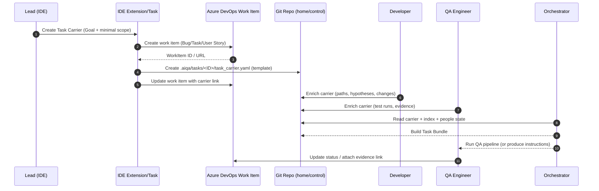

# Объединённый PBI: внедрение task-centric AI QA framework в крупной мульти-репо среде

## Executive summary

Этот PBI описывает внедрение **task-centric AI QA framework** для организации стандартизированного, воспроизводимого и безопасного процесса выполнения задач (Work Items) в среде, где одна задача регулярно затрагивает **несколько больших репозиториев**, а артефакты (код, тесты, конфиги, логи, SQL, документация) распределены по разным местам. Центральное решение — перейти от “repo-centric” работы к **work_item-centric**: система собирает контекст вокруг задачи и участников, а репозитории выступают источниками, а не единицей управления.

Ключевые конструкты:
- **Task Carrier** — постоянный “каркас задачи”, создаваемый из IDE (Cursor/VSCode) и постепенно обогащаемый лидом, разработчиком и QA на этапах pipeline.
- **Task Bundle** — временный runtime-набор контекста, который оркестратор собирает под конкретный прогон (QA/Dev/Docs/RCA).
- **People Profiles** (stable + active) — формализованный профиль “как человек работает” + текущий фокус/контекст, чтобы ускорять маршрутизацию и сбор релевантных источников.
- **Иерархический Repository Index** — индекс не только репозитория, но и подсистем/сервисов/папок (особенно важно для “огромных” реп типа трейдера/OMS).
- **Orchestrator deterministic-first** — сначала правила/таксономия/маппинги, LLM используется точечно (когда правила не дают уверенного результата).

Интеграция предусматривает связь с entity["organization","Azure DevOps","devops platform"]: создание/обновление work item через API/CLI, хранение ссылок и метаданных задачи, и при необходимости мульти-репо checkouts в CI. Azure DevOps поддерживает создание и обновление work items через REST API, включая требования по правам/скоупам, что позволяет формально “шить” Task Carrier в рабочий процесс. citeturn0search0turn0search3turn1search3

Ограничения и роли репозиториев фиксируются заранее:  
- **AI-tools** — рабочая база (qa-agent и др.)  
- **AI-framework-4-myMommy** — experimental (донор идей/фич)  
- **mobileLiteApp** — external legacy; используется только для диагностики, чтобы подтверждать “проблема на внешней стороне”, не как зона ответственности.

## PBI цель и критерии приёмки

**Цель PBI (one-liner):** внедрить единый стандартизированный “контейнер задачи” (Task Carrier) + оркестратор и индекс источников, чтобы задачи в мульти-репо среде выполнялись по воспроизводимому pipeline с управляемым контекстом, прозрачной ответственностью и измеримым качеством.

**Scope (в пределах PBI):**
- V1 модель сущностей, файловая структура и минимальные схемы.
- “Create / Enrich / Run pipeline” workflow из IDE (Cursor/VSCode) с привязкой к Azure DevOps work item.
- Оркестратор (deterministic-first) + маршрутизация по work_item/person/service.
- Репозиторный индекс (иерархический) и правила мульти-репо работы.
- V1 пайплайны: QA / Dev / Docs / RCA (минимальные runnable skeletons).
- Governance: роли репозиториев (core/domain/experimental/external), ownership и permission notes.

**Out of scope (явно не в этом PBI):**
- Полная автоматизация анализа огромных репозиториев “в глубину” без ограничений (в V1 — только иерархический индекс + правила).
- Полностью автономный агент, который сам пишет код/тесты end-to-end без human review.
- Интеграция с каждым внутренним тулом/мониторингом/лог-агрегатором (в V1 — plug-in интерфейсы и 1–2 референсных интеграции).

### Критерии приёмки — бизнес

- Лид/PO может создать задачу в IDE и получить **Task Carrier** с единым форматом и ссылкой на соответствующий work item в Azure DevOps; каркас содержит минимум: цель, критерии готовности, затронутые сервисы/репы, владельцев, риски. (Канал создания — расширение VS Code или CLI-обвязка, см. варианты ниже.)
- На этапах Dev и QA Task Carrier дополняется и сохраняет “truth” по задаче: что сделано, какие тесты/артефакты добавлены, где доказательства, какой статус.
- Время на “поднятие контекста” по задаче (по оценке команды) снижается за счёт стандартизированного carrier + task bundle (фиксируем как KPI V1: метрика вводится, конкретный целевой порог — уточняется у PO).

### Критерии приёмки — технические

- Оркестратор принимает Work Item ID и/или путь к Task Carrier и гарантированно строит Task Bundle в детерминированном режиме, используя taxonomy+маппинги, и **логирует** решения маршрутизации.
- Для мульти-репо задач оркестратор умеет:
  - выбрать **home репозиторий carrier** (или central control repo),
  - собрать bundle из нескольких репозиториев/папок по индексу,
  - применять правила “read-only” для external/legacy.
- Индекс репозиториев построен и версионируется; он иерархический (repo → subsystem/service → paths → artifact types).
- Пайплайны QA/Dev/Docs/RCA существуют как runnable skeletons (пусть минимальные), а правила/таксономия позволяют выбрать pipeline для типовых work item.
- Интеграция с Azure DevOps реализует create/update work item программно (API или CLI), с минимально необходимыми правами доступа. Azure DevOps REST API поддерживает create/update work items, а Azure CLI имеет команды `az boards work-item create/update/show`. citeturn0search0turn0search3turn2search2turn2search6

## Подробный технический дизайн

### Архитектурные принципы

- **Work-item как первичная сущность:** все решения (routing, контекст, пайплайн) “вращаются” вокруг Work Item/Task Carrier, а не вокруг репозитория.
- **Deterministic-first:** правила → таксономия → маппинги → fallback (LLM/heuristics) только при низкой уверенности.
- **Контекст минимально достаточный:** Task Bundle собирается “узко”, по индексу и сервисной карте; цель — избежать утопления в огромном количестве нерелевантного кода.
- **Версионирование и аудируемость:** carrier/index/taxonomy живут в git (или управляемом хранилище), изменения ревьюятся.
- **Роли репозиториев:**
  - `core` — framework/контракты/оркестратор.
  - `domain` — доменное наполнение (например трейдинг/OMS).
  - `experimental` — донор идей/фич (например AI-framework-4-myMommy).
  - `external` — “чужое/legacy”; read-only, используется только для диагностики (mobileLiteApp).

### Сущности и минимальные YAML-схемы

Ниже — **практические V1-схемы**, которые можно сразу коммитить как шаблоны. (Это не JSON Schema; V1 достаточно как соглашение, позже можно формализовать.)

#### Person (stable profile)

```yaml
schema: aiqa.person_profile.v1
person:
  id: sergey
  display_name: "Sergey"
  role: backend_dev
  domains:
    - trading
    - oms
  typical_work:
    repos:
      - etna-trader
      - oms-services
      - qa-automation
    services:
      - oms
      - risk-manager
    artifact_preferences:
      - swagger
      - logs
      - sql
      - configs
  responsibilities:
    - implement_features
    - fix_bugs
    - code_review
  constraints:
    external_repos_readonly: true
```

#### Person (active state)

```yaml
schema: aiqa.person_state.v1
person_state:
  person_id: sergey
  as_of: "2026-03-24"
  current_focus:
    work_items:
      - "EXT-12345"
      - "EXT-12399"
    domains:
      - oms
  hot_paths:
    - repo: etna-trader
      paths:
        - "src/OMS/"
        - "src/Clearing/"
  notes:
    - "Сейчас чаще всего нужна экспертиза по OMS margin logic"
```

#### WorkItem (нормализованная форма)

```yaml
schema: aiqa.work_item.v1
work_item:
  provider: azure_devops
  id: "EXT-12345"
  title: "Fix margin calculation inconsistency"
  type: "Bug"
  state: "Active"
  area_path: "Trader/OMS"
  iteration_path: "Sprint 12"
  owners:
    lead: "lead_id"
    dev: ["sergey"]
    qa: ["qa_id"]
  domain: "oms"
  services:
    - oms
    - risk-manager
  repos:
    primary: etna-trader
    secondary:
      - qa-automation
      - oms-services
```

#### Repository (иерархическая индексируемая модель)

```yaml
schema: aiqa.repository.v1
repository:
  name: etna-trader
  role: domain
  size_class: huge
  subsystems:
    - name: OMS
      services:
        - oms
      paths:
        code:
          - "src/OMS/"
        configs:
          - "src/OMS/config/"
        docs:
          - "docs/OMS/"
    - name: Clearing
      services:
        - clearing
      paths:
        code:
          - "src/Clearing/"
  ownership:
    primary_team: "trader-team"
  access:
    read: ["trader-team", "qa-team"]
    write: ["trader-team"]
```

#### Service

```yaml
schema: aiqa.service.v1
service:
  name: oms
  domain: trading
  repos:
    - etna-trader
    - oms-services
  interfaces:
    - type: swagger
      ref: "internal://swagger/oms"
  observability:
    logs: "internal://logs/oms"
```

#### Artifact

```yaml
schema: aiqa.artifact.v1
artifact:
  type: test_case
  ref: "repo://qa-automation/tests/oms/margin_test.yaml"
  work_item_id: "EXT-12345"
  owner: "qa_id"
  created_at: "2026-03-24"
  evidence:
    - type: run_link
      ref: "internal://ci/run/123"
```

#### Pipeline

```yaml
schema: aiqa.pipeline.v1
pipeline:
  id: qa.regression.v1
  kind: QA
  steps:
    - fetch_task_bundle
    - run_tests
    - publish_report
    - update_task_carrier
  gates:
    - all_tests_pass
    - evidence_attached
```

#### TaskBundle (runtime)

```yaml
schema: aiqa.task_bundle.v1
task_bundle:
  work_item_id: "EXT-12345"
  built_at: "2026-03-24T10:00:00+07:00"
  inputs:
    task_carrier_ref: ".aiqa/tasks/EXT-12345/task_carrier.yaml"
    people_state_refs:
      - ".aiqa/people/active/sergey.yaml"
  selected_context:
    repos:
      - name: etna-trader
        paths:
          - "src/OMS/"
          - "docs/OMS/"
      - name: qa-automation
        paths:
          - "tests/oms/"
    artifacts:
      - "internal://swagger/oms"
      - "internal://logs/oms"
  policy:
    external_repos_readonly: true
```

#### TaskCarrier (постоянный каркас)

```yaml
schema: aiqa.task_carrier.v1
task_carrier:
  work_item:
    provider: azure_devops
    id: "EXT-12345"
    url: "ado://org/project/_workitems/edit/EXT-12345"
  stage: dev_in_progress  # lead_created | dev_in_progress | qa_in_progress | rca | done
  intent:
    goal: "Исправить расхождение расчёта маржи"
    done_definition:
      - "Регрессионные тесты зелёные"
      - "Есть доказательства причины и фикса"
  scope:
    domain: oms
    services: [oms, risk-manager]
    repos:
      primary: etna-trader
      related: [qa-automation, oms-services]
  ownership:
    lead: "lead_id"
    dev: ["sergey"]
    qa: ["qa_id"]
  context:
    provided_by_lead:
      links: []
      notes: []
    discovered_in_dev:
      code_paths: []
      hypotheses: []
    qa_evidence:
      test_runs: []
      attachments: []
    rca:
      root_cause: null
      fix_summary: null
  external_dependencies:
    - name: mobileLiteApp
      role: external
      access: readonly
      allowed_usage: "diagnostics_only"
```

### Таблица сравнения опций хранения Task Carrier

| Опция | Где хранится carrier | Плюсы | Минусы | Рекомендация V1 |
|---|---|---|---|---|
| Repo-native | YAML в “home repo” (или control repo) | Версионирование, review, прозрачный diffs, легко расширять | Нужно выбрать “дом” для мульти-репо задач | ✅ Да |
| Только в Azure DevOps | Поля/описание work item + вложения | Единая точка в ADO, привычно PO | Ограничения по полям/форматам/лимитам; хуже версионирование | ⚠️ Только метаданные |
| External storage | БД/сервис/портал | Гибкость, интеграции | Инфраструктура + доступы + риск “ещё один инструмент” | ❌ Не для V1 |
| Hybrid | YAML в repo + summary/links в ADO | Лучшее из двух миров | Нужна синхронизация/правила | ✅ Оптимально |

Azure DevOps позволяет программно создавать и обновлять work items, что упрощает стратегию Hybrid: “heavy” контент хранить в repo, а “операционные” поля и ссылки — в work item. citeturn0search0turn0search3

## Интеграция с IDE и workflow Task Carrier

### Целевой UX

1) Лид создаёт задачу из IDE (Cursor/VSCode) командой вроде **“AIQA: Create Task Carrier”**.  
2) Выбирает тип work item (Bug/Task/User Story), домен/сервис, primary repo (или “auto”).  
3) Система:
- создаёт work item в Azure DevOps (REST или CLI) и получает ID, citeturn0search0turn2search2  
- создаёт папку `.aiqa/tasks/<ID>/` и шаблон `task_carrier.yaml`,  
- заполняет минимальные поля (goal/done definition/ownership/scope),  
- добавляет ссылку на carrier в ADO (например, URL репо или attachment/ссылка),  
- опционально — создаёт ветку/commit template.

**Почему это реалистично:**  
- Azure DevOps поддерживает REST API для создания work items и обновления полей. citeturn0search0turn0search3  
- Есть Azure CLI команды для работы с Azure Boards (`az boards work-item create/update/show`), что удобно для IDE интеграции через tasks/scripts. citeturn2search2turn2search6  
- VS Code extension API даёт стандартные UX-паттерны (например Quick Pick) для выбора домена/репозитория/пайплайна. citeturn1search2turn1search13  
- Cursor поддерживает импорт настроек/расширений VS Code, что снижает стоимость поддержки единого расширения/скриптов для обеих IDE. citeturn0search10  
- Для работы с Azure Repos/Boards в VS Code существуют расширения (официальные и community), которые можно использовать как базу/референс поведения. citeturn2search16turn2search17turn2search4

### Mermaid: жизненный цикл создания и обогащения carrier



### Таблица сравнения опций IDE-интеграции

| Опция | Реализация | Плюсы | Минусы | Рекомендация V1 |
|---|---|---|---|---|
| VS Code extension | Команда + UI (QuickPick) + REST/CLI | Лучший UX; единый entry-point | Нужно поддерживать расширение | ✅ Да (если есть ресурсы) |
| IDE tasks/scripts | `tasks.json` + CLI (`az boards`) + шаблоны | Быстро, дёшево, работает сразу | UX слабее, больше ручных шагов | ✅ Да (как MVP) |
| Только ADO UI | Создание через веб-форму | Никакой разработки | Нет IDE-first, хуже обогащение carrier | ❌ Не соответствует цели |
| CI-triggered carrier | Carrier создаётся только из pipeline | Полный контроль | Слишком поздно, ломает “lead creates from IDE” | ⚠️ Позже |

## Orchestrator lifecycle и routing алгоритмы

### Lifecycle (коротко)

Оркестратор выполняет несколько фаз:
- загрузка Work Item и Task Carrier,
- расчёт “контекстного профиля” (people + services + repo index),
- детерминированная маршрутизация (pipeline + источники),
- сбор Task Bundle,
- исполнение pipeline (или генерация инструкций/PR/тест-плана),
- запись результатов обратно (carrier + ADO fields/links).

Эта модель согласуется с практикой “pipeline как механизм автоматизации build/test/validate изменений” и “feedback в PR/workflow”. citeturn1search1turn1search4

### Mermaid: routing (deterministic-first)

```mermaid
flowchart TD
  A[Input: WorkItem ID or Carrier Path] --> B[Load Task Carrier]
  B --> C[Fetch Work Item metadata from ADO]
  C --> D[Load People Profiles (stable + active)]
  D --> E[Load Repo Index + Service Map]
  E --> F{Deterministic routing<br/>taxonomy.yaml rules}
  F -->|High confidence| G[Select Pipeline (QA/Dev/Docs/RCA)]
  F -->|Low confidence| H[Fallback: heuristic/LLM classification]
  H --> G
  G --> I[Build Task Bundle (min context)]
  I --> J[Execute pipeline steps]
  J --> K[Write outputs: carrier updates + links + status]
```

### Псевдокод маршрутизации

```pseudo
function route(work_item_id, carrier_path):
  carrier = load_yaml(carrier_path)
  wi = ado_get_work_item(work_item_id)          # REST/CLI
  people = load_people_profiles(carrier.ownership + wi.assigned_to)
  idx = load_repo_index()
  svc_map = load_service_map()

  features = extract_features(wi, carrier, people, idx, svc_map)

  decision = deterministic_rules(taxonomy.yaml, features)
  if decision.confidence < THRESHOLD:
      decision = fallback_classifier(features)

  bundle = build_task_bundle(decision, carrier, people, idx, svc_map)
  return decision.pipeline_id, bundle
```

**Почему “deterministic-first” уместен в PBI:** для крупных организаций “управляемость” важнее, чем “магия”; детерминированный роутинг легче аудировать, обсуждать с лидами и закреплять в политике/шаблонах. В Azure DevOps есть механизмы шаблонов и контроля разрешённых операций в pipeline, что хорошо сочетается с управляемыми правилами. citeturn1search7turn1search9

## Индексирование репозиториев и правила работы при мульти-репо задачах

### Требования к индексу

Индекс в V1 должен отвечать на вопрос: **какие места в каких репозиториях имеют отношение к домену/сервису/типу артефакта**.

Для “огромных” реп это ключевое: мы индексируем не “repo целиком”, а иерархию:
- repo → subsystem/service → paths (code/config/docs/tests) → owners/teams → ограничения доступа.

### Как поддерживать мульти-репо контекст

**Правило V1: “одна задача — один carrier дом (home)”**  
- Carrier хранится в *home repo* (выбранном маршрутизатором) **или** в отдельном control repo (если это корпоративный стандарт).  
- В carrier всегда есть список “related repos” и “relevant paths” (по мере уточнения).  
- Task Bundle может включать контекст из нескольких реп, но всегда с “policy” (например external read-only).

**Пайплайны/CI (если нужно прогонять сборки/тесты на нескольких репах):** Azure Pipelines поддерживает **checkout нескольких репозиториев** в одном прогоне и также поддерживает объявление репозиториев как ресурсов в YAML. citeturn0search2turn0search8turn0search11

### Таблица сравнения опций индексации (V1)

| Опция | Механика | Плюсы | Минусы | Рекомендация V1 |
|---|---|---|---|---|
| Manual curated index | YAML вручную + review | Быстро, управляемо, объяснимо | Нужно дисциплина обновления | ✅ Да |
| Semi-automatic | Скрипт: скан путей + owners + “hotspots” | Экономит время, расширяемо | Нужны интеграции (CODEOWNERS/teams) | ✅ Да (после MVP) |
| Full semantic indexing | Эмбеддинги всего кода | Хорошо для поиска | Риск утечки/пермиссий; дорого; шумно для huge repo | ❌ Не для V1 |
| CI-generated index | Индекс обновляется в pipeline | Консистентность | Требует инфраструктуры | ⚠️ V1.5 |

## Security, ownership, roadmap и управление внедрением

### Security/ownership/permissions notes

- Для интеграции с Azure DevOps REST API нужны корректные права доступа и принцип “least privilege”. В REST API документации явно указаны необходимые scopes, например `vso.work_write` для операций с work items. citeturn0search0turn1search3  
- entity["company","Microsoft","software company"] отмечает, что REST API поддерживают более гранулярные PAT scopes, что позволяет избегать “full-scoped tokens” и снижать риск при утечке токена. citeturn1search0  
- Для новых приложений Microsoft рекомендует аутентификацию через Microsoft Entra ID OAuth (и отмечает, что “Azure DevOps OAuth 2.0” режим депрекейтнут и не принимает новые регистрации). Это влияет на дизайн “IDE extension ↔ ADO”: лучше проектировать под Entra-auth, а PAT использовать ограниченно/в MVP. citeturn1search6  
- Для ограничения рисков в CI можно использовать YAML templates как “policy gate”: шаблон может ограничивать allowed tasks/steps, повышая управляемость и безопасность пайплайнов. citeturn1search7  
- Для external/legacy репозиториев (mobileLiteApp) вводится политика “read-only + diagnostics_only”; оркестратор обязан логировать факт обращения к external источнику.

### Roadmap V1 (deliverables, приоритеты, усилия)

Оценки ниже — ориентировочные для согласования; если команда не готова оценивать — помечено как **unspecified**.

| Deliverable | Содержание | Приоритет | Оценка усилий |
|---|---|---|---|
| `aiqa/contracts/` | V1 соглашения по сущностям, форматам, обязательным полям | P0 | 10–16 ч |
| `aiqa/taxonomy.yaml` | Домены/сервисы/типы задач → пайплайны → правила routing | P0 | 8–14 ч |
| `aiqa/people/profiles/` | Stable profiles + шаблоны; минимум 3–5 ролей | P0 | 6–10 ч |
| `aiqa/people/active/` | Active state формат + процедура обновления | P1 | 4–8 ч |
| `aiqa/repo_index/` | Иерархический индекс 1–2 ключевых больших реп (MVP) | P0 | 12–24 ч |
| `aiqa/orchestrator/` | Router + bundle builder + логирование решений | P0 | 16–32 ч |
| IDE MVP (tasks/scripts) | CLI-обвязка: create/enrich carrier + ADO sync | P0 | 8–16 ч |
| IDE extension (optional) | VS Code extension (QuickPick UI) | P1 | unspecified |
| Pipelines skeletons | QA/Dev/Docs/RCA runnable skeletons | P0 | 12–20 ч |
| ADO sync policy | Поля/линки/статусы + update правила | P1 | 6–12 ч |

**Примечание по мульти-репо задачам:** если выбран подход “central control repo”, усилия на bootstrap могут увеличиться (настройка доступа/процессов), но затем упрощается поддержка.

### Checklist для дейлика (операционный)

- Обновлён ли `taxonomy.yaml` для новых доменов/сервисов?
- Появился ли новый Work Item, который должен иметь `.aiqa/tasks/<ID>/task_carrier.yaml`?
- Для active задач:
  - заполнены ли `ownership` и `done_definition`?
  - добавлены ли `relevant_paths` и минимальная сервисная привязка?
  - есть ли QA evidence (links/runs) для задач на QA стадии?
- Был ли доступ к external (mobileLiteApp)? Если да — зафиксирована ли цель “diagnostics_only” и доказательная база?
- Есть ли “конфликт контекстов” (работа в нескольких репах) без обновления carrier? Если да — назначить владельца carrier и обновить `scope.repos`.

### Бизнес-обоснование и риски

**Бизнес-обоснование:** стандартизированный Task Carrier уменьшает потери контекста при передаче между lead/dev/QA, ускоряет RCA, снижает повторяемость ошибок, и делает мульти-репо работу предсказуемой за счёт routing+index. На уровне платформы это приближает процесс к “release engineering” практике, где автоматизация build/test/validate и прозрачная отчётность являются нормой. citeturn1search1turn1search4

**Основные риски и меры:**
- Риск “carrier не заполняют” → Mitigation: минимально обязательные поля + checklists + PR template/CI check на наличие carrier.
- Риск “слишком много контекста” → Mitigation: strict bundle policy (min paths), иерархический индекс, лимиты на включаемые директории.
- Риск “security / токены” → Mitigation: least privilege scopes, переход на Entra OAuth для новых интеграций, отказ от full-scoped PAT. citeturn1search0turn1search6
- Риск “мульти-репо конфликт ownership” → Mitigation: правило home carrier + явный owner секции carrier + логирование изменений.

