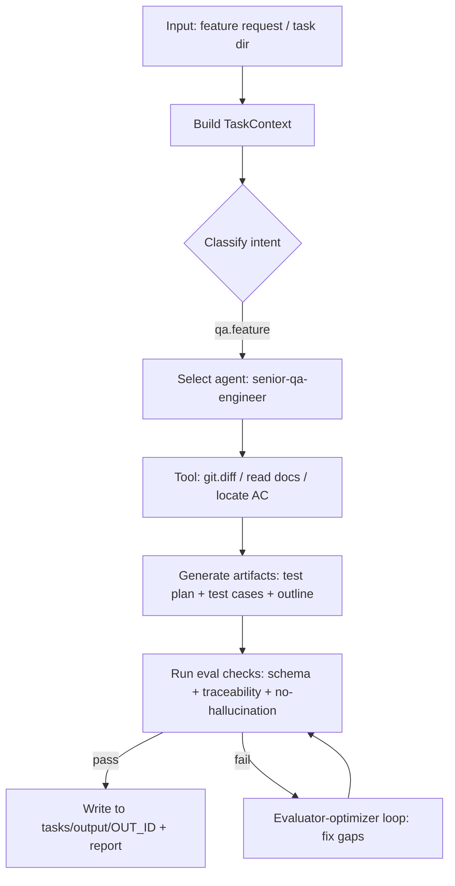

# Целевая структура production-ready AI QA framework для ваших репозиториев

## Executive summary

В ваших репозиториях уже есть два сильных «кирпича», из которых можно собрать production-ready AI QA framework с упором на **reproducibility**, **проверяемость**, **простоту**, **интеграцию инструментов** и **eval-driven development**:

1) **AI-framework-4-myMommy** — это готовый пример того, как формализовать «фреймворк» вокруг LLM: модульные skills, оркестратор, жёсткие правила анти‑галлюцинаций и самое важное для production — **QA‑контур для самого фреймворка** (чеклист + правило обязательного прогона + автотесты/скрипт проверки структуры артефактов). citeturn32view4turn15view0turn16view2turn16view3turn26view0turn23view0

2) **AI-tools** — это заготовка «индустриального» workspace под инженерные задачи: параллельные конфиги под **Claude/Cursor**, автосинк конфигов и docs через hooks, богатая база **docs** и уже оформленные **skills + агенты**, включая сильный QA‑агент и skill `/qa` с режимами (test plan / test cases / automation / coverage review). citeturn32view5turn31view0turn30view2turn30view5turn32view1turn35view0

Целевая архитектура, которую имеет смысл зафиксировать как «стандарт» для всех трёх репозиториев, выглядит так:

- **Source-of-truth слой**: YAML‑контракты skills и агентов + декларативные workflows оркестратора + спецификации tool‑интеграций + eval‑наборы (datasets/fixtures/graders), всё версионируется и тестируется.
- **Runtime/IDE слой**: адаптеры, которые превращают контракты в формат конкретной среды (например, `.cursor/skills/**/skill.md`, `.claude/skills/**/skill.md`) и поддерживают синхронизацию (ваша текущая практика sync‑скриптов — отличный фундамент). citeturn31view0turn30view2turn30view5
- **Eval-driven development** как основной цикл: успех определяется не «ощущениями», а метриками и проверками; это прямо соответствует рекомендациям entity["company","OpenAI","ai platform"] про evals/agent evals/trace grading и подходам entity["company","Anthropic","ai safety company"] к evaluator‑optimizer и rigor в evals. citeturn20view3turn21view0turn37view0turn20view0turn20view1

Ниже — конкретные артефакты «под внедрение»: целевая структура, YAML‑контракты, спецификация оркестратора (routing/classifier/workflows), набор eval‑проверок, инструменты и псевдокод router’а, roadmap и точечные рекомендации по нормализации существующих файлов.

---

## Исходное состояние репозиториев и ключевые ограничения

### Наблюдения по текущей зрелости

**AI-framework-4-myMommy**
- Структура repo уже «framework‑like»: есть `.cursor/`, `tasks/`, `tests/`, `tools/`, зависимости для тестов. citeturn32view4  
- Есть оркестратор‑skill, который явно задаёт дисциплину: сначала классификация задачи, затем выбор нужных навыков, запрет на выдумывание источников и фактов, режимы STRICT/TEACHER/STUDENT. citeturn15view0turn14view4turn16view1  
- Есть QA‑контур фреймворка: чеклист QA после правок, и правило «обязательный прогон после изменений в `.cursor/` и связанном», плюс автотесты, проверяющие структуру `tasks/output`. citeturn16view2turn16view3turn26view0turn25view0  

**AI-tools**
- Это «workspace infrastructure» под инженерный продукт: `.claude/` и `.cursor/` одновременно, `docs/`, `scripts/`. citeturn32view5turn8view1turn8view2  
- Автоматизация консистентности: hooks запускают синхронизацию `AGENTS.md`↔`CLAUDE.md` и `.cursor`↔`.claude`. citeturn31view0turn30view2turn30view5  
- Уже есть QA‑skill `/qa` (с режимами и явными артефактами в `tasks/`) и QA‑agent `senior-qa-engineer` с описанием стека тестов, артефактов, требований к недопущению выдуманных деталей и т.п. citeturn32view1turn35view0  
- Есть «rules» по торговому домену (API patterns, C# conventions, DB migrations, testing architecture) — это важно как часть knowledge слоя QA framework. citeturn33view0  

**AI-tools/more-tools**
- Похоже на второй «инстанс» той же инженерной схемы, но для mobile app: аналогичные skills/agents/rules и развитая docs‑структура (auth, env vars, infra). Это полезно как доказательство того, что вам нужен единый стандарт + доменные «оверлеи». citeturn18view2turn27view0  

### Не указано (важно для production) — и как с этим жить без навязывания

- **CI/CD система** для самих AI‑реп (GitHub Actions / Jenkins / другое) — не указано. В ETNA‑документации упоминаются `deployment/` и Jenkins как часть большого продукта, но для AI‑framework реп лучше предусмотреть нейтральные варианты. citeturn22view2  
- **Предпочитаемые языки реализации оркестратора/инструментов** — не указано. В ваших репах уже есть Python (pytest), PowerShell, Node.js — можно выбрать минимально-инвазивный стек (например, Python для eval harness + тонкий Node/CLI для sync). citeturn23view0turn25view0turn31view0turn30view5  
- **Где жить tool-интеграциям** (локально, в dev‑контуре, в облаке; как аутентифицироваться) — не указано. Ниже предложены два профиля: local‑dev (stdio) и shared‑env (SSE) в логике MCP. citeturn38view0turn20view5  

---

## Целевая структура репозитория

Ниже — **целевая структура**, рассчитанная на то, чтобы стать «стандартом» для каждого из трёх репозиториев. Ключевой принцип: **source-of-truth** живёт не в `.cursor/` и не в `.claude/`, а в явной папке `aiqa/` (или аналогичной), а `.cursor/.claude` становятся **адаптерами/рендерами** (можно оставить и как ручной слой на старте, но целиться стоит в генерацию + проверки). Это напрямую усиливает reproducibility и тестируемость.

### Таблица структуры (папки/файлы)

| Путь | Тип | Назначение | Что внутри / форматы | Примечания для внедрения |
|---|---|---|---|---|
| `aiqa/README.md` | файл | «главная» документация QA framework | Markdown: цели, SLA, принципы, быстрый старт | Дублирует по смыслу `FRAMEWORK_INDEX.md`, но уже для QA‑домена |
| `aiqa/contracts/skills/` | папка | **Source-of-truth** для skills | `*.skill.yaml` (контракт) + `*.prompt.md` (инструкции/примеры) | Контракт должен быть валидируемым схемой |
| `aiqa/contracts/agents/` | папка | Source-of-truth для агентов | `*.agent.yaml` (роль/способности/разрешённые инструменты) | Маппится на ваши agent-файлы (например, `senior-qa-engineer.md`) citeturn35view0 |
| `aiqa/orchestrator/` | папка | оркестратор (routing/classifier/workflows) | `routes.yaml`, `taxonomy.yaml`, `workflows/*.yaml`, `policies/*.md` | Декларативно; код — отдельно |
| `aiqa/tools/` | папка | спецификации инструментов | `tools.yaml` (каталог), `schemas/*.json`, `adapters/*` | Поддержка logs/sql/swagger/diff |
| `aiqa/tools/mcp/` | папка | MCP server(ы) для tool-calling | `server.py`/`server.ts`, `README.md`, `auth.md` | MCP описывает Tools/Resources/Prompts citeturn20view5turn37view4turn37view5 |
| `aiqa/knowledge/` | папка | docs/knowledge для QA | `docs_index.yaml`, `sources/*.md`, `glossary.md` | В ETNA у вас уже сильный `docs/` (API infra, testing guide) citeturn22view0turn28view0 |
| `aiqa/evals/` | папка | eval-driven development набор | `datasets/*.jsonl`, `fixtures/`, `graders/`, `harness/` | См. раздел «Evals» ниже; совместим с рекомендациями OpenAI по datasets/evals citeturn21view1turn21view0 |
| `aiqa/evals/harness/run.py` | файл | запуск eval harness | Python CLI: прогон тест матрицы, сбор артефактов | Должен писать trace/artifacts и агрегировать метрики |
| `aiqa/evals/graders/` | папка | авто‑грейдеры | Python/JS: правила, JSONSchema‑валидация, heuristic checks | Концептуально соответствует «checks → score» citeturn20view4turn20view3 |
| `aiqa/evals/reports/` | папка | выход eval отчётов | `*.md`, `*.json`, `*.html` | Хранить в artefacts CI, не обязательно коммитить |
| `aiqa/runtime/` | папка | код оркестратора и runtime SDK | `router.py`, `models.py`, `tool_client.py` | Минимальный код; максимум — декларативно |
| `aiqa/runtime/tracing/` | папка | трассировка/логирование агента | `trace_schema.json`, `redaction.yaml` | Важно для workflow-level evals (trace grading) citeturn37view0turn21view0 |
| `.cursor/` | папка | IDE‑адаптер под Cursor | `skills/`, `agents/`, `rules/`, `hooks.json` | У вас уже есть практика hooks+sync citeturn31view0turn30view2 |
| `.claude/` | папка | IDE‑адаптер под Claude Code | `skills/`, `agents/`, `rules/` | В AI-tools это уже есть + синхронизируется citeturn8view0turn30view2 |
| `scripts/` | папка | утилиты репозитория | `sync-*.js`, генераторы, линтер контрактов | В AI-tools уже есть `sync-docs.js`, `sync-configs.js` citeturn8view2turn30view5turn30view2 |
| `tools/` | папка | CLI/скрипты проверок | PowerShell/Python проверки структуры, линтеры | В AI-framework-4-myMommy — хороший пример `verify-tasks-output-layout.ps1` citeturn23view0 |
| `tests/` | папка | тесты репозитория | pytest/унит-тесты линтеров и структур | Пример: структурные тесты `tasks/output` уже есть citeturn26view0turn26view2 |
| `tasks/` | папка | артефакты работы (human+agent) | `input/`, `output/`, `runs/` | В AI-framework-4-myMommy это уже формализовано и тестируется citeturn16view3turn26view0turn25view0turn23view0 |
| `tasks/input/` | папка | входные данные | `feature/*.md`, `bug/*.md`, `prd/*.md`, `swagger/*.json` | Важна типизация входов для classifier |
| `tasks/output/<OUT_ID>/` | папка | выходы по задаче | `withF/`, `withoutF/`, отчёты, тест-планы | Принцип OUT_ID и ветвления уже автопроверяется citeturn25view0turn26view0turn23view0 |
| `tasks/runs/<RUN_ID>/` | папка | трассы / артефакты исполнения | `trace.json`, `tool_calls.jsonl`, `artifacts/` | Нужна для воспроизводимости и trace grading citeturn37view0turn21view0 |
| `pyproject.toml` / `requirements-dev.txt` | файл | зависимости eval harness | Python deps: pytest, jsonschema и т.д. | В AI-framework-4-myMommy уже есть `requirements-dev.txt` citeturn32view4 |
| `.github/workflows/` | папка | CI pipeline | `ci.yml` (lint contracts + pytest + smoke evals) | Конкретная система не указана → оставить как опция |

### Почему эта структура соответствует вашим приоритетам

- **Reproducibility**: все решения (routing, contract, tools) декларативны и версионируемы; артефакты исполнения складываются в `tasks/runs/`.  
- **Проверяемость**: встроенные структурные тесты/линтеры (как в AI-framework: проверки `tasks/output`) дают быстрый «детерминированный» сигнал, даже до LLM‑evals. citeturn26view0turn25view0  
- **Простота**: source-of-truth один; IDE‑адаптеры можно генерировать/синхронить по правилам, как вы уже делаете для `.cursor/.claude` и docs. citeturn31view0turn30view2turn30view5  
- **Eval-driven development**: выделенный `aiqa/evals/` и метрики как gate в CI соответствуют рекомендациям OpenAI: от «define objective → dataset → metrics → run/compare» и идее, что evals — способ управлять недетерминизмом. citeturn20view3turn21view1turn36search18  
- **Зрелость по уровням** (Prompt library → Skills → Orchestrator → Agentic system): структура явно отражает каждый слой, и позволяет двигаться постепенно, как в подходах Anthropic (routing / orchestrator-workers / evaluator-optimizer). citeturn20view0turn20view1  

---

## Унифицированный skill contract (YAML): шаблон, пример, критерии качества

В ваших репах уже есть «псевдо‑контракт» в YAML‑frontmatter внутри `skill.md` (см. описания полей в skill-creator). citeturn12view1  
Цель — расширить это до **полноценного контракта**, который:
- валидируется схемой;
- хранит требования к инструментам и артефактам;
- указывает, какие eval‑проверки обязательны;
- служит единым источником для генерации `.cursor/.claude` skills.

### Шаблон `*.skill.yaml` (source-of-truth)

```yaml
id: qa.feature_test_plan
version: 1.0.0
name: "Feature QA: test plan + cases + automation outline"
owner: "qa-platform"
maturity_level: "skills"   # prompt_library | skills | orchestrator | agentic_system

domain:
  product: "ETNA_TRADER"   # или "framework-core", "MobileLiteApp", "teacher-history"
  area: "qa"

description:
  short: "Генерирует QA deliverables для фичи: test plan, test cases, automation outline."
  when_to_use:
    - "write test plan"
    - "qa for feature"
    - "design test cases"
    - "automate test"
  when_not_to_use:
    - "code review"         # направить на /sr
    - "implementation"      # направить на /si

inputs:
  required:
    - name: feature_name
      type: string
    - name: task_path
      type: string
      description: "Путь к task-директории (если есть)"
  optional:
    - name: acceptance_criteria
      type: string
    - name: swagger_url_or_path
      type: string
    - name: env
      type: string
      enum: ["dev", "stage", "prod"]
  context_sources:
    - kind: repo_files
      paths:
        - "docs/"
        - "tasks/"
        - "qa/"
    - kind: tools
      required_tools:
        - "git.diff"
        - "swagger.search"
        - "sql.query_readonly"
        - "logs.search"

outputs:
  artifacts:
    - id: test_plan
      path_template: "tasks/output/{out_id}/withoutF/test-plan-{feature_name}.md"
      format: markdown
    - id: test_cases
      path_template: "tasks/output/{out_id}/withoutF/test-cases-{feature_name}.md"
      format: markdown
    - id: automation_outline
      path_template: "tasks/output/{out_id}/withoutF/automation-outline-{feature_name}.md"
      format: markdown

tool_policy:
  allowed:
    - git.diff
    - git.show_file
    - swagger.search
    - swagger.get_schema
    - sql.query_readonly
    - logs.search
  safety:
    sql:
      mode: "readonly"
      max_rows: 200
    logs:
      redact:
        - "Authorization"
        - "access_token"
        - "password"
    network:
      allowlist_domains: []   # не указано -> оставить пустым и документировать

quality_criteria:
  must:
    - "Каждый тест-кейс привязан к AC/требованию (traceability)."
    - "Явно помечать неизвестные детали как [OPEN_QUESTION] или [PSEUDOCODE]."
    - "Не выдумывать эндпоинты/поля: если Swagger не предоставлен — запросить или отметить неопределённость."
  should:
    - "Сбалансировать пирамиду тестов: unit/integration/e2e в разумных долях."
    - "Указать риски, регрессии, entry/exit criteria."
  must_not:
    - "Не включать недостоверные утверждения о системе."
    - "Не предлагать destructive SQL."

routing:
  intent: "qa"
  task_type: "feature"
  priority: 80
  required_agents:
    - "senior-qa-engineer"

evals:
  required:
    - "eval.format.schema_artifacts"
    - "eval.trace.tool_usage_required"
    - "eval.content.no_hallucinated_api"
    - "eval.coverage.ac_coverage"
  thresholds:
    pass_score: 0.85
```

### Таблица полей контракта и критерии качества

| Поле | Обяз. | Тип | Зачем | Критерий качества (проверяемый) |
|---|---:|---|---|---|
| `id`, `version` | да | string | стабильная идентификация skill | семвер, неизменность `id` после релиза |
| `maturity_level` | да | enum | отражает вашу модель зрелости | используется оркестратором для допуска в production |
| `domain` | да | object | разделение «core vs продукт» | не смешивать правила разных доменов |
| `inputs.*` | да | schema-like | типизация входа для classifier/router | валидируемость + минимальный набор для запуска |
| `outputs.artifacts` | да | list | воспроизводимые пути артефактов | детерминированные path_template + структурные тесты, как в AI-framework citeturn25view0turn26view0 |
| `tool_policy.allowed` | да | list | ограничение tool‑поверхности | логи/SQL/Swagger доступны только явно |
| `quality_criteria` | да | object | анти‑галлюцинации + верификация | «must/must_not» → автоматические чекеры |
| `routing.*` | да | object | декларативная маршрутизация | router не «угадывает» — он исполняет правила |
| `evals.required` | да | list | eval-driven development | без required evals skill не считается production‑ready citeturn20view3turn20view4 |

### Как связать это с вашими текущими skill.md

- В AI-tools `skill.md` уже содержит мета‑заголовок и детальный workflow с «gates» (пример `/qa`). citeturn32view1  
- В AI-framework-4-myMommy skills устроены «папка + SKILL.md», и есть строгий anti‑hallucination skill. citeturn14view4turn16view1  

Практическая рекомендация:
- Оставить существующие `skill.md`/`SKILL.md` как **human-readable runtime слой**.
- Добавить рядом `contract.skill.yaml` (source-of-truth).
- Ввести линтер: «contract ↔ skill.md совпадают по name/intent/allowed-tools/outputs». Это даст проверяемость без большого рефакторинга.

---

## Спецификация orchestrator: классификатор, правила маршрутизации, workflows

### Архитектурные принципы оркестратора

Вы уже применяете «оркестратор‑мышление» в двух местах:

- teacher orchestrator: классифицировать задачу → выбрать навыки → идти последовательно и не выдумывать факты. citeturn15view0turn16view0turn16view1  
- `/qa` skill: есть режимы (FULL/TCs/AUTOMATION/ARCHITECTURE/COVERAGE REVIEW), и до выдачи артефакта нужно собрать контекст и определить режим. citeturn32view1  

Целевой orchestrator должен стать **тонким слоем**, который:
1) строит `TaskContext` (из входа + repo + tools);
2) классифицирует intent/task_type;
3) выбирает workflow (последовательность skills/agents/tools);
4) фиксирует артефакты и trace;
5) запускает eval checks как gate (локально/CI).

Это соответствует паттернам Anthropic «routing», «orchestrator‑workers» и «evaluator‑optimizer» — важно, что эти паттерны рекомендуются как простые компонуемые блоки, а не «гигантский фреймворк». citeturn20view0turn20view1turn36search2  

### Taxonomy: минимальный классификатор задач QA framework

Рекомендуемая taxonomy (первый production‑контур; расширять потом):

- `qa.feature` — QA deliverables для фичи (plan/cases/automation outline)
- `qa.regression` — регрессионный анализ по PR diff / релизу
- `qa.coverage_audit` — аудит покрытия (unit/integration/e2e) по изменённым зонам
- `bug.triage` — triage инцидента/бага (logs + sql + swagger)
- `api.contract_check` — проверка API контрактов (Swagger/OpenAPI + backward compatibility)
- `release.notes_and_ac` — release notes + acceptance criteria (аналог `ai-settings`) citeturn32view2  
- `framework.maintenance` — обслуживание самого фреймворка (линк‑консистентность, синхронизация, тесты) — аналог вашего framework‑qa подхода. citeturn16view3turn16view2  

### Routing rules: что должно быть декларативным

`aiqa/orchestrator/routes.yaml` (идея): правила вида:

- if `intent=qa` & `has_task_dir=true` → workflow `wf.qa.from_task_dir`
- if `intent=bug` & `has_request_id=true` → workflow `wf.bug.triage.with_logs`
- if `intent=api.contract_check` & `has_swagger=true` → workflow `wf.api.swagger_contract`
- if `intent=framework.maintenance` → workflow `wf.framework.qa_gate`

Ключевая мысль: router должен быть **скучным**. «Ум» — в skill контрактах, инструментах и eval‑гейтах.

### Примеры workflows (mermaid)

#### Workflow: QA deliverables для фичи (test plan + cases + outline)



Связь с best practices:
- evaluator‑optimizer как цикл «генерация → оценка → улучшение» рекомендован Anthropic, когда есть ясные критерии качества. citeturn20view0turn20view1  
- «успех определён до реализации» и «checks + score» как дисциплина eval‑подхода подчёркнуты в руководстве OpenAI про testing agent skills. citeturn20view4  

#### Workflow: Bug triage с logs + SQL + Swagger

```mermaid
flowchart TD
  A[Input: bug report / incident / requestId] --> B[Build TaskContext]
  B --> C{Signals present?}
  C -->|requestId| D[Tool: logs.search(requestId)]
  C -->|no requestId| E[Ask for correlation/request id or repro steps]
  D --> F[Extract: endpoint + error + timestamps]
  F --> G[Tool: swagger.search(endpoint)]
  F --> H[Tool: sql.query_readonly(key entities)]
  G --> I[Hypothesis set + suspected contract mismatch]
  H --> I
  I --> J[Generate: triage report + repro + test suggestions]
  J --> K[Eval: evidence-backed claims only]
```

Почему MCP здесь удобен:
- MCP определяет Tools как интерфейс для вызова внешних систем моделями; tools «model‑controlled» (модель может выбирать инструменты), а resources «application‑driven». citeturn20view5turn37view4  
- В Google‑обзоре MCP прямо подчёркивается роль MCP как стандарта для подключения LLM к внешним данным/сервисам и необходимость security/consent. citeturn38view0  

#### Workflow: Regression / coverage audit по PR diff

```mermaid
flowchart TD
  A[Input: PR / diff / changed files] --> B[Tool: git.diff]
  B --> C[Classifier: change-type (feature/bugfix/refactor/config)]
  C --> D[Map changes -> components -> test layers]
  D --> E[Generate: risk matrix + regression plan]
  E --> F[Eval: coverage completeness + consistency]
  F --> G[Output: tasks/output/OUT_ID/ report]
```

Здесь у вас уже есть семя — `ai-settings` ориентирован на анализ diff перед выпуском/коммитом. citeturn32view2  

---

## Evals и метрики: что проверять и как автоматизировать

### Почему evals — это обязательный production-компонент

- OpenAI прямо фиксирует проблему: генеративные системы вариативны, традиционные тесты недостаточны, evals нужны для тестирования и надёжности. citeturn20view3turn36search18  
- Для агентных систем дополнительно критичны многошаговость и tool‑вызовы; Anthropic подчёркивает, что без evals команды быстро застревают в «реактивных» циклах исправлений только в проде. citeturn20view1  
- Для workflow‑ошибок OpenAI рекомендует trace grading, потому что trace evals помогают понимать «почему» агент успешен/провален. citeturn37view0turn21view0  

### Набор eval checks (минимальный production‑пакет)

Ниже — практичный набор, привязанный к вашим требованиям (coverage/consistency/hallucination + tool‑интеграции + артефакты).

| Check ID | Тип | Что проверяет | Автоматизация | Метрика/порог |
|---|---|---|---|---|
| `eval.format.schema_artifacts` | deterministic | артефакты созданы по path_template, формат валиден | JSONSchema + файловые проверки | pass/fail |
| `eval.structure.tasks_output_layout` | deterministic | структура `tasks/output` соответствует правилам | pytest/PS1 по образцу AI-framework | pass/fail citeturn26view0turn23view0 |
| `eval.trace.tool_usage_required` | trace-based | если skill требует tools — они реально использованы | анализ `tool_calls.jsonl` | tool_coverage ≥ 0.9 |
| `eval.trace.no_forbidden_tools` | trace-based | запрет на опасные инструменты (write SQL, prod actions) | allowlist/denylist | pass/fail |
| `eval.content.no_hallucinated_api` | content heuristic | не заявлены эндпоинты/поля без Swagger/доказательства | regex + ссылочная дисциплина | hallucination_rate ≤ X |
| `eval.coverage.ac_coverage` | semantic+heuristic | все AC/requirements покрыты тестами/проверками | парсинг AC + mapping | coverage ≥ 0.85 |
| `eval.consistency.no_contradictions` | semantic | нет внутренних противоречий (статусы/правила/слои) | LLM‑grader + rules | score ≥ 0.9 |
| `eval.usability.actionable_output` | heuristic | отчёт можно использовать: шаги, команды, где файлы | правила структуры | score ≥ 0.8 |

### Как строить eval harness (unit/e2e/eval)

**Трёхслойная модель проверок** (рекомендуемая для простоты и скорости):

1) **Детерминированные unit‑checks** (самые дешёвые): структура директорий, валидность YAML/JSONSchema, наличие обязательных секций.  
   - У вас уже есть отличный паттерн: тесты структуры `tasks/output` и отдельный PowerShell‑скрипт, «зеркалящий» pytest‑логику. Это идеально как «быстрый CI gate». citeturn25view0turn26view0turn23view0  

2) **Trace‑checks**: проверять не только финальный текст, но и «шаги», например: был ли вызван `git.diff`, был ли использован Swagger при заявлении об API. Это совпадает с идеей OpenAI о trace evals/trace grading. citeturn37view0turn21view0  

3) **LLM‑graders / semantic evals**: покрытие AC, согласованность, качество reasoning без «внутренних рассуждений наружу». В OpenAI‑подходе eval — это «prompt → captured run (trace+artifacts) → checks → score». citeturn20view4turn20view3  

---

## Инструменты и интеграции: logs, SQL, Swagger, PR diffs + пример router на Python

### Каталог необходимых tools/скриптов

С учётом ваших требований (logs, SQL, Swagger, PR diffs) и текущих практик (git diff анализ в `ai-settings`, QA артефакты и requestId), разумный минимальный каталог инструментов выглядит так:

| Tool name | Назначение | Пример входа | Пример выхода | Замечания по безопасности |
|---|---|---|---|---|
| `git.diff` | получить diff по ветке/PR | `{base, head}` | unified diff + список файлов | read-only |
| `git.show_file` | прочитать файл по пути/ревизии | `{path, ref}` | текст | redact secrets |
| `swagger.search` | найти endpoint/схему | `{query}` | список методов/путей | read-only |
| `swagger.get_schema` | получить request/response schema | `{path, method}` | JSON schema | источник истины для API claims |
| `sql.query_readonly` | read-only SQL | `{query, params}` | rows + schema | лимиты по строкам/таймаутам |
| `logs.search` | поиск логов (requestId/correlationId) | `{request_id, window}` | события, уровни, stacktrace | обязательная редация токенов |
| `pr.files_changed` | список изменённых файлов | `{pr_id}` | paths + stats | read-only |
| `doc.search` | поиск по docs/knowledge индексу | `{query}` | релевантные фрагменты | предотвращает галлюцинации |
| `eval.run` | запустить eval harness | `{suite}` | summary + artefacts | используется в CI |

Технически это можно реализовать:
- как локальные команды/скрипты (быстро, просто);
- или как MCP сервер(ы), чтобы стандартизировать tool‑calling и разнести ответственность. MCP формализует Tools/Resources/Prompts и разделяет их interaction модели. citeturn20view5turn37view4turn37view5turn38view0  
При этом в OpenAI‑документации подчёркивается, что tool calling — это способ подключить модель к данным/действиям приложения, а structured outputs — способ строго формализовать ответы. citeturn37view1turn37view2  

### Минимальный router на Python (псевдокод)

Ниже — каркас, рассчитанный на ваши YAML‑контракты и workflows.

```python
from dataclasses import dataclass
from typing import Any, Dict, List, Optional

@dataclass
class TaskContext:
    text: str
    task_path: Optional[str]
    signals: Dict[str, Any]           # request_id, swagger_path, pr_id, etc.
    repo_state: Dict[str, Any]        # branch, changed_files, etc.

@dataclass
class RouteDecision:
    intent: str
    task_type: str
    workflow_id: str
    required_agents: List[str]
    required_tools: List[str]
    confidence: float
    reasons: List[str]

class ContractRegistry:
    def load(self, root: str) -> None: ...
    def get_workflow(self, workflow_id: str) -> Dict[str, Any]: ...
    def get_skill(self, skill_id: str) -> Dict[str, Any]: ...
    def get_agent(self, agent_id: str) -> Dict[str, Any]: ...

class Classifier:
    def classify(self, ctx: TaskContext) -> Dict[str, Any]:
        """
        Two-stage:
        1) deterministic rules (keywords + signals)
        2) LLM classifier fallback (optional)
        """
        # stage 1: signals
        if ctx.signals.get("request_id"):
            return {"intent": "bug.triage", "task_type": "incident", "confidence": 0.85}
        if ctx.signals.get("pr_id") or "diff" in ctx.text.lower():
            return {"intent": "qa.regression", "task_type": "pr", "confidence": 0.8}

        # stage 1: keywords
        t = ctx.text.lower()
        if "test plan" in t or "тест-план" in t:
            return {"intent": "qa.feature", "task_type": "feature", "confidence": 0.7}
        if "swagger" in t or "openapi" in t:
            return {"intent": "api.contract_check", "task_type": "api", "confidence": 0.7}

        # stage 2: fallback (optional, keep reproducible by fixing prompt+model)
        return {"intent": "qa.feature", "task_type": "feature", "confidence": 0.55}

class Router:
    def __init__(self, registry: ContractRegistry, classifier: Classifier):
        self.registry = registry
        self.classifier = classifier

    def decide(self, ctx: TaskContext) -> RouteDecision:
        c = self.classifier.classify(ctx)
        intent = c["intent"]
        task_type = c["task_type"]

        # declarative lookup: routes.yaml
        routes = self.registry.get_workflow("routes")  # pseudo: load all routing rules
        selected = self._match(routes, intent=intent, task_type=task_type, ctx=ctx)

        # derive required tools/agents from workflow steps
        workflow = self.registry.get_workflow(selected["workflow_id"])
        required_agents, required_tools = [], []
        for step in workflow["steps"]:
            if step["type"] == "skill":
                skill = self.registry.get_skill(step["skill_id"])
                required_agents += skill.get("routing", {}).get("required_agents", [])
                required_tools += skill.get("tool_policy", {}).get("allowed", [])

        return RouteDecision(
            intent=intent,
            task_type=task_type,
            workflow_id=selected["workflow_id"],
            required_agents=sorted(set(required_agents)),
            required_tools=sorted(set(required_tools)),
            confidence=c["confidence"],
            reasons=selected.get("reasons", []),
        )

    def run(self, ctx: TaskContext) -> Dict[str, Any]:
        decision = self.decide(ctx)
        run_id = self._start_trace(decision, ctx)

        # execute workflow
        workflow = self.registry.get_workflow(decision.workflow_id)
        artifacts = []
        for step in workflow["steps"]:
            artifacts += self._exec_step(step, ctx, decision, run_id)

        # eval gate
        eval_result = self._run_evals(workflow["eval_suite"], run_id, artifacts)
        if not eval_result["pass"]:
            # optional evaluator-optimizer loop
            artifacts = self._refine_until_pass(ctx, decision, run_id, artifacts)

        return {"decision": decision, "artifacts": artifacts, "run_id": run_id}
```

Ключевые design choices:
- «Two-stage classifier» — стабилизирует поведение (reproducibility) и экономит токены.
- «Routes declarative» — проще ревьюить и тестировать, чем «умный» код router’а.
- «Trace + eval gate» — обязательный элемент, если вы хотите production‑надёжность (и это совпадает с подходом OpenAI к workflow-level ошибкам и trace grading). citeturn37view0turn21view0turn20view4  

---

## План миграции и интеграция с существующими файлами в репозиториях

### Roadmap по этапам (с оценкой трудозатрат и рисками)

| Этап | Что делаем | Effort | Основные риски | Как минимизировать |
|---|---|---|---|---|
| Стандартизация артефактов и структуры | Ввести `aiqa/`, `contracts/`, `orchestrator/`, `evals/`; зафиксировать `tasks/output` правила и гейт | med | ломка привычных путей/имен | начать с совместимости: не переносить `.cursor` сразу, а добавить `aiqa` рядом |
| Контракты skills/agents | Добавить `*.skill.yaml` рядом с ключевыми skills (`qa`, `ai-settings`, framework-maintenance), `*.agent.yaml` для QA‑агента | med | расхождение «контракт vs реальный текст skill.md» | линтер «контракт ↔ runtime», автотесты на консистентность (по примеру framework‑qa checklist) citeturn16view2turn16view3 |
| Оркестратор v1 | Реализовать router (как выше) + `routes.yaml` + первые workflows | med | classifier будет «тупить» на границах | явные сигналы (task_path/requestId/pr_id), правила приоритетов, fallback в ask-user только при реальной неоднозначности |
| Tool layer v1 (diff + swagger + sql + logs) | Сначала CLI-tools, затем MCP сервер (опционально) | high | безопасность (секреты, prod доступ), сложность инфраструктуры | read-only режим, редация, allowlist, лимиты; MCP security/consent принципы явно оформить citeturn38view0turn20view5turn37view1 |
| Eval harness v1 | Набор deterministic checks + trace checks + LLM graders | med/high | дорого/долго прогонять, false positives | разделить на smoke (PR) и nightly; держать deterministic checks быстрыми; калибровать graders на реальных кейсах citeturn20view3turn21view1turn20view1 |
| CI/CD интеграция | подключить lint contracts + pytest + smoke eval suite | low/med | не указана целевая CI система | дать 2 пресета: GitHub Actions и Jenkins pipeline (как опции) |
| Генерация `.cursor/.claude` из контрактов (опционально) | заменить «копирование» на «рендер из source-of-truth» | high | усложнение и «магия генератора» | вводить после стабилизации контрактов; оставить fallback на ручной режим; использовать существующие sync‑хуки как транспорт citeturn31view0turn30view2 |

### Рекомендации по интеграции и нормализации существующих файлов

Ниже — прагматичная карта «что куда» без разрушения текущей структуры в первый день.

#### AI-framework-4-myMommy: что сохранить как эталон и что переиспользовать

| Текущий артефакт | Почему важен | Рекомендация в целевой архитектуре |
|---|---|---|
| `.cursor/framework-qa/FRAMEWORK_QA_CHECKLIST.md` | формализует QA для самого framework | перенести/дублировать как `aiqa/evals/policies/framework_qa_checklist.md`; сделать gate в CI citeturn16view2 |
| `.cursor/rules/framework-qa.mdc` | правило «после правок фреймворка прогнать QA и отчитаться» | перенести идею в `aiqa/orchestrator/policies/framework_maintenance.md` + eval suite `framework.smoke` citeturn16view3 |
| `tests/test_tasks_output_layout.py` + `tests/output_layout_checks.py` | быстрые детерминированные проверки структуры артефактов | обобщить: `aiqa/evals/graders/structure_tasks_output.py` и подключить в CI citeturn26view0turn25view0 |
| `tools/verify-tasks-output-layout.ps1` | удобный локальный способ прогнать check без Python | оставить как developer tool; добавить аналогичный для `contract lint` citeturn23view0 |
| `th-10-hallucination-guard` | явные анти‑галлюцинационные правила | переиспользовать как общий `eval.content.no_hallucinated_claims` и как policy для всех QA‑skills citeturn16view1 |

#### AI-tools: что нормализовать в первую очередь для AI QA framework

| Текущий артефакт | Почему важен | Рекомендация |
|---|---|---|
| `.cursor/skills/qa/skill.md` | уже задаёт QA workflow и режимы | добавить `aiqa/contracts/skills/qa.feature_*.skill.yaml`; `skill.md` оставить runtime‑слоем citeturn32view1 |
| `.cursor/skills/ai-settings/skill.md` | уже делает «diff-driven» анализ и pre-commit качество | перенести как отдельный intent `release.notes_and_ac` и включить в orchestrator routing citeturn32view2 |
| `.cursor/agents/qa-agents/senior-qa-engineer.md` | чётко описан QA агент и требования «не выдумывать» + артефакты | сделать `aiqa/contracts/agents/senior-qa-engineer.agent.yaml`; расширить capabilities под logs/sql/swagger citeturn35view0 |
| `.cursor/hooks.json` + `scripts/sync-*.js` | уже есть автоматика консистентности | сохранить; расширить новым этапом `node scripts/lint-contracts.js` перед sync citeturn31view0turn30view2turn30view5 |
| `docs/` (API infra, testing guide, project structure) | knowledge слой для QA и anti‑hallucination | подключить как `aiqa/knowledge` индекс + tool `doc.search` citeturn22view0turn28view0turn8view1 |
| `.cursor/rules/trading-*` | доменные нормы (API/C#/DB/testing) | оформить как resources/knowledge, чтобы QA‑skills ссылались на нормы и не спорили с ними citeturn33view0 |

#### AI-tools/more-tools: как использовать без «размножения сущностей»

Этот подпроект полезен как «второй домен», который подтверждает, что **единый baseline** + **доменные расширения** — правильная стратегия (skills, docs, env vars, auth). citeturn27view0turn18view2  

Рекомендация:
- не смешивать доменные контракты: держать `domain.product: ETNA_TRADER` отдельно от `MobileLiteApp`;
- общий core: `aiqa/contracts/tools` и `aiqa/evals` могут быть общими;
- доменные workflows: разнести по `aiqa/orchestrator/workflows/<product>/...`.

### Как поддержать «простоту» и не построить монстра

Практический принцип из Anthropic: успешные системы часто строятся на простых компонуемых паттернах (routing, chaining, parallelization, orchestrator‑workers, evaluator‑optimizer), а не на сложных фреймворках. citeturn36search2turn20view0  

Поэтому «минимально жизнеспособный production‑контур» для вас может быть таким:
1) YAML‑контракты + линтер + deterministic tests (как у вас уже сделано для структуры `tasks/output`). citeturn25view0turn26view0  
2) Router v1 с 5–7 intents.  
3) Tool layer v1: diff + swagger + sql read-only + logs search.  
4) Smoke eval suite на PR + nightly расширенный прогон.

---

### Короткая сверка с вашими обязательными требованиями

- **Цель: production-ready AI QA framework** — достигается через contracts + tools + eval gates + tracing. citeturn20view3turn37view0  
- **Reproducibility/проверяемость** — детерминированные проверки структуры (образец у вас уже есть) + фиксация артефактов + trace‑evals. citeturn26view0turn23view0turn37view0  
- **Интеграция инструментов (logs/SQL/Swagger/PR diffs)** — заложена как tool каталог и tool_policy в skill contracts; MCP как стандартный «клей» (опционально). citeturn20view5turn38view0turn37view1  
- **Eval-driven development** — отдельный eval слой, checks+score, trace grading как путь к workflow-level качеству. citeturn20view4turn21view1turn21view0turn37view0  
- **Уровни зрелости (Prompt library → Skills → Orchestrator → Agentic system)** — отражены в структуре и `maturity_level` контрактов; постепенный рост без «большого взрыва». citeturn20view0turn20view1  

