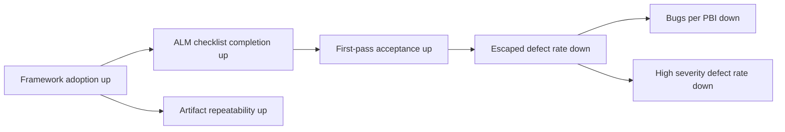

> Supporting knowledge. This document is an internal proposal for an AI QA metrics MVP. It is intended for alignment, discussion, and implementation planning. It is not a canonical framework contract.

# AI QA Metrics MVP Proposal

## Executive summary

This document proposes a small, operational AI QA metrics MVP for internal use across four teams: Clearing Team, Platform Team, Mobile Lite App Team, and Optimization Team.

The goal is to create a metric set that is useful for decisions, realistic to collect, and simple enough to pilot without building a heavy reporting process around it. The proposal intentionally keeps the MVP to six metrics only: three outcome metrics, two leading/process metrics, and one framework quality metric.

This metric set is designed to help answer three practical questions:

1. Is quality improving?
2. Is process discipline improving?
3. Is the AI QA framework producing repeatable artifacts rather than one-off outputs?

## Purpose

The purpose of this proposal is to define a first version of AI QA metrics that can support:

- internal alignment across teams
- discussion with Team Leads and management
- implementation planning for data collection and dashboarding
- a weekly feedback loop during pilot adoption

The document is intentionally practical. It does not try to measure everything. It focuses on a limited set of signals that can support real delivery decisions.

## Team structure

There are exactly four teams in scope:

1. Clearing Team
2. Platform Team
3. Mobile Lite App Team
4. Optimization Team

Additional org facts that shape this proposal:

- The user belongs to Platform Team.
- The user is a QA engineer in Platform Team.
- The user is not a lead.
- The user is not a Team Lead.
- The user is not a Test Lead.
- The user is not a QA Lead.
- Platform Team has a Team Lead.
- Platform Team does not have a Test Lead role.
- Platform Team does not have a QA Lead role.

The current pilot context also matters:

- Clearing Team, Platform Team, and Mobile Lite App Team are actively trying the framework now
- the teams meet weekly to collect feedback and refine the process

## Roles and responsibility model

This proposal uses a team-based responsibility model. It does not rely on hero ownership and does not assign responsibility to roles that do not exist.

### Team ownership

- Teams own the quality outcomes of their own delivery scope.
- Teams own the completeness of their own artifacts and process usage.
- Platform Team is the primary home for framework and process evolution.
- Clearing Team owns clearing-domain interpretation and relevance.
- Mobile Lite App Team owns mobile and client-side interpretation and relevance.
- Optimization Team is part of the reporting scope and should be included in team-level outcome views where applicable.

### Team Lead decision role

The Team Lead is the decision-maker for:

- prioritizing metric adoption work inside the team
- resolving rollout trade-offs
- approving dashboard use for team-level review
- deciding whether a metric is mature enough to influence planning or process changes

The Team Lead is not the single owner of all metric operations. The role is decision-oriented, not a substitute for team execution.

### QA engineer contributor role

The QA engineer contributes to:

- metric analysis
- validation of definitions and formulas
- test artifacts and checklist quality
- framework evolution feedback
- interpretation of signal quality during weekly review

The QA engineer is not presented as an org owner, and this document does not assign organization-wide ownership to the QA engineer.

## Metrics design principles

The MVP follows a few strict principles.

### 1. No vanity metrics

Metrics must support a decision. If a metric looks impressive but does not help decide what to improve, it should not be in the MVP.

### 2. Small MVP over broad coverage

Too many metrics create noise, weaken accountability, and make dashboard adoption harder. A six-metric MVP is large enough to show quality, process discipline, and framework quality without becoming a reporting burden.

### 3. Separate outcomes from drivers

Outcome metrics show whether quality is improving. Leading/process metrics show whether the team is doing the right things consistently. Framework quality metrics show whether the framework itself is producing reusable outputs.

### 4. Use real ownership only

The proposal uses team-level ownership and real existing roles. It does not invent Test Lead or QA Lead ownership where those roles do not exist.

### 5. Prefer collectable signals

Metrics should come from systems or artifacts the teams already use, or from additions that are small and operationally realistic.

### 6. Keep the metrics tied to action

Each metric should support a real conversation: quality risk, process discipline, artifact quality, or rollout refinement.

## AI QA Metrics MVP

### Outcome metrics

- `Bugs per PBI`
- `Escaped defect rate`
- `High severity defect rate`

### Leading / process metrics

- `ALM checklist completion rate`
- `First-pass acceptance rate`

### Framework quality metric

- `Artifact repeatability rate`

This is the full MVP. No additional metrics are included in the MVP baseline.

## Metric dictionary

| Name | Definition | Formula | Likely data source | Cadence | Owner | Reason it matters |
|---|---|---|---|---|---|---|
| `Bugs per PBI` | Average number of confirmed defects associated with completed PBIs in the measured scope | `confirmed defects / closed PBIs` | Azure DevOps or equivalent work-item and bug tracker data | Monthly | Each team for its own scope; cross-team rollup is shared | Shows whether delivered work is getting cleaner over time |
| `Escaped defect rate` | Share of confirmed defects that were found after the intended validation stage | `escaped defects / all confirmed defects` | Bug tracker with stage or source classification | Monthly | Each team for its own scope; cross-team review is shared | Shows how much quality is still escaping the intended validation process |
| `High severity defect rate` | Rate of high-impact defects relative to delivered scope | `high severity + critical defects / closed PBIs` | Bug tracker severity field plus PBI data | Monthly | Each team for its own scope | Focuses attention on business-relevant quality failures, not just volume |
| `ALM checklist completion rate` | Share of in-scope work items that contain the required AI QA artifact set | `items with complete checklist / in-scope items` | ALM fields, task folders, or required artifact presence checks | Weekly during pilot, then monthly summary | Each team for its own completion; Platform Team for checklist definition | Measures process discipline and basic framework usage quality |
| `First-pass acceptance rate` | Share of items accepted without returning for avoidable rework after first review or validation pass | `items accepted on first pass / accepted items in scope` | ALM workflow history, task review cycle notes | Weekly during pilot, then monthly summary | Each team for its own scope | Indicates whether preparation quality and artifact quality are improving early enough |
| `Artifact repeatability rate` | Share of AI QA-assisted items that produce complete, reusable, and reproducible artifact packages without manual reconstruction | `repeatable artifact packages / AI QA-assisted items` | Task folders, artifact review checklist, pilot review notes | Weekly during pilot, then monthly summary | Platform Team for framework/process quality, with input from all participating teams | Tests whether the framework produces reliable outputs rather than one-off results |

## Ownership model

Ownership is team-based and split by decision type.

| Area | Primary owner | Supporting teams | Notes |
|---|---|---|---|
| Framework process definition | Platform Team | Clearing Team, Mobile Lite App Team, Optimization Team | Platform is the primary home for framework/process ownership |
| Clearing-domain interpretation | Clearing Team | Platform Team | Clearing-specific relevance should stay with the clearing team |
| Mobile/client interpretation | Mobile Lite App Team | Platform Team | Mobile-specific relevance should stay with the mobile team |
| Team-level outcome reporting | Each team for its own scope | All teams in shared review | Outcome metrics may be rolled up across teams, but not assigned to fake org roles |
| Dashboard design and MVP refinement | Platform Team | Clearing Team, Mobile Lite App Team, Optimization Team | Platform leads the framework side; refinement remains collaborative |

This model intentionally avoids:

- global ownership by one person
- fake ownership by non-existent roles
- assigning all responsibility to one QA function

## Causal model

The metrics matter because they form a simple decision chain.

If framework adoption and process discipline improve, the team should see better artifact completeness and cleaner first-pass outcomes. That should reduce escaped defects and lower defect volume per delivered scope.

This is not a claim of perfect causation. It is a practical working model for decision-making during the pilot.

## Dashboard structure

The dashboard should stay simple and readable. One page is enough for the MVP.

### 1. Outcome

- `Bugs per PBI`
- `Escaped defect rate`
- `High severity defect rate`

Suggested view:

- trend by team
- last completed period
- simple variance indicator

### 2. Leading / Process

- `ALM checklist completion rate`
- `First-pass acceptance rate`

Suggested view:

- weekly trend during pilot
- team comparison
- drill-down to missing checklist or rework patterns

### 3. Framework Quality

- `Artifact repeatability rate`

Suggested view:

- team-level trend
- sample review notes or artifact audit result

The dashboard should support discussion, not just display numbers. The MVP should favor clarity over density.

## Rollout approach

The rollout should be practical and small.

### Phase 1. Define the metric dictionary

- confirm the six metric definitions
- align formulas and edge cases
- agree what counts as in-scope work

### Phase 2. Confirm data sources

- verify which metrics can be collected from ALM data
- verify which metrics require task-artifact review
- identify any data that is currently missing or inconsistent

### Phase 3. Confirm owners

- confirm team-level ownership for each metric
- confirm Team Lead decision points
- confirm QA engineer contribution model

### Phase 4. Configure fields and artifacts

- define required checklist fields or artifact markers
- define how escaped defects and first-pass acceptance will be recognized consistently
- define how repeatable artifact packages will be judged

### Phase 5. Build the MVP dashboard

- create one lightweight dashboard
- keep slicing by team simple
- avoid over-designed visualization at the MVP stage

### Phase 6. Pilot and refine

- use weekly feedback sessions with the active pilot teams
- review whether the signals are trustworthy
- remove ambiguity before expanding the metric set

## Risks and anti-patterns

This proposal should explicitly avoid the following failure modes.

### Fake ownership

Assigning the dashboard or all metrics to one imaginary QA lead would make the model inaccurate and harder to operate.

### Vanity metrics

Metrics that track activity without helping a decision should not be added to the MVP.

### Overcomplicated dashboard

A dashboard with too many widgets, filters, or categories will lower adoption and reduce discussion quality.

### Uncollectable data

If a metric depends on data that teams cannot gather consistently, it should not drive decisions until collection is stable.

### Measuring activity instead of quality

Framework usage alone is not success. The important question is whether usage improves process quality and outcome quality.

### False precision

Metrics should not pretend to be more reliable than the data collection process actually allows.

## Next steps

1. Review the six metric definitions with the participating teams.
2. Confirm the exact ALM fields and artifact checks needed for collection.
3. Confirm team-level ownership and Team Lead decision points.
4. Build one MVP dashboard with the three reporting groups.
5. Run the weekly pilot review cycle and refine definitions before any expansion.

## Authoring Notes

### Assumptions intentionally avoided

- No QA Lead or Test Lead role was invented for Platform Team.
- No single-person global owner was assumed.
- No target values, thresholds, or baselines were invented where they were not explicitly provided.
- No claim was made that the framework already has mature automated reporting.
- No extra MVP metrics were added beyond the required six.

### Org mistakes corrected compared to weak earlier drafts

- Replaced fake role-based ownership with team-based ownership.
- Removed any implication that the user is a lead or org owner.
- Kept decision authority with the Team Lead without turning the Team Lead into the sole operational owner.
- Anchored framework/process ownership in Platform Team while preserving domain ownership in Clearing Team and Mobile Lite App Team.

### Ready for review vs still needs validation

Ready for review:

- section structure
- MVP metric set
- ownership model
- dashboard grouping
- rollout sequence

Still needs validation:

- exact ALM field mapping
- exact rule for classifying escaped defects
- exact rule for first-pass acceptance in local workflow
- exact review method for artifact repeatability
- whether and how Optimization Team is included in the first dashboard slice
