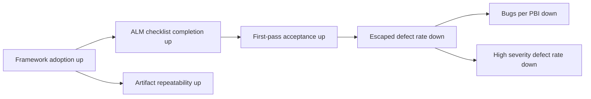
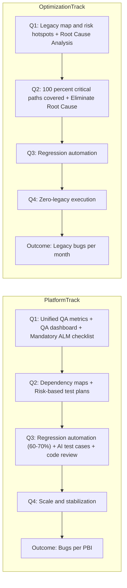

> Поддерживающий документ. Это внутреннее предложение по MVP-набору метрик для AI QA. Документ предназначен для синхронизации ожиданий, обсуждения и планирования внедрения. Он не является каноническим контрактом фреймворка.

# AI QA Metrics MVP Proposal

## Executive summary

Этот документ предлагает небольшой, прикладной MVP-набор метрик для AI QA, рассчитанный на использование внутри четырех команд: Clearing Team, Platform Team, Mobile Lite App Team и Optimization Team.

Цель набора метрик проста: получить сигналы, которые реально помогают принимать решения, которые можно собрать без тяжелого отчетного процесса и которые достаточно легко запустить в пилоте. Поэтому MVP намеренно ограничен шестью метриками: тремя outcome-метриками, двумя leading/process-метриками и одной framework quality-метрикой.

При этом документ нужно читать как локальный pilot/MVP-срез, а не как полную roadmap-модель. На roadmap-уровне важны две outcome-линии: `Bugs per PBI` для Platform Team и `Legacy bugs per month` для Optimization Team. В этом документе сохраняется более узкий pilot-фокус на шести метриках, которые удобны для быстрого запуска и еженедельной обратной связи.

Этот набор метрик должен помочь ответить на три практических вопроса:

1. Улучшается ли качество?
2. Улучшается ли процессная дисциплина?
3. Дает ли AI QA framework повторяемые артефакты, а не одноразовый результат?

## Purpose

Назначение этого предложения - определить первую версию AI QA метрик, которую можно использовать для:

- внутреннего выравнивания между командами
- обсуждения с Team Leads и management
- планирования сбора данных и проектирования dashboard
- еженедельного цикла обратной связи в ходе пилота

Документ специально сделан практичным. Он не пытается измерить все сразу. Он фокусируется на ограниченном наборе сигналов, которые могут поддерживать реальные delivery-решения.

## Team structure

В область документа входят ровно четыре команды:

1. Clearing Team
2. Platform Team
3. Mobile Lite App Team
4. Optimization Team

Для текущего пилота также важно, что:

- Clearing Team, Platform Team и Mobile Lite App Team уже пробуют framework на практике
- команды встречаются раз в неделю для сбора фидбека и уточнения процесса

Roadmap-контекст для этого MVP тоже важен:

- Platform track на roadmap идет по цепочке Q1 `Unified QA metrics`, `QA dashboard`, `Mandatory ALM checklist` -> Q2 `Dependency maps`, `Risk-based test plans` -> Q3 `Regression automation (60-70%)`, `AI test cases + code review` -> Q4 `Scale & stabilization`
- Optimization track на roadmap идет по цепочке Q1 `Legacy map & risk hotspots identified`, `Root Cause Analysis` -> Q2 `100% critical paths covered`, `Eliminate Root Cause` -> Q3 `Regression automation` -> Q4 `Zero-legacy execution`
- этот документ не заменяет roadmap-экран и не пытается целиком переписать оба трека в один pilot-набор метрик

## Metrics design principles

MVP строится на нескольких жестких принципах.

### 1. No vanity metrics

Метрика должна помогать принять решение. Если метрика выглядит красиво, но не помогает понять, что именно улучшать, ей не место в MVP.

### 2. Small MVP over broad coverage

Слишком большое количество метрик создает шум, размывает ответственность и делает dashboard хуже с точки зрения принятия решений. Шесть метрик достаточно, чтобы видеть качество, процессную дисциплину и качество самого framework, не превращая все в тяжелую reporting-систему.

### 3. Separate outcomes from drivers

Outcome-метрики показывают, улучшается ли качество. Leading/process-метрики показывают, делает ли команда правильные вещи последовательно. Framework quality-метрика показывает, дает ли framework воспроизводимый результат.

### 4. Prefer collectable signals

Метрики должны опираться на системы и артефакты, которыми команды уже пользуются, либо на небольшие и реалистичные процессные добавки.

### 5. Keep the metrics tied to action

Каждая метрика должна поддерживать реальный разговор: о quality risk, process discipline, artifact quality или rollout refinement.

## AI QA Metrics MVP

### Outcome metrics

- `Bugs per PBI`
- `Escaped defect rate`
- `High severity defect rate`

### Leading / process metrics

- `ALM checklist completion rate`
- `First-pass acceptance rate`

### Framework quality metric

- `Artifact repeatability rate`

Это и есть полный MVP для pilot/MVP-среза. Дополнительные метрики в baseline этого документа не включаются.

Важно: roadmap-level outcome для Optimization Team остается `Legacy bugs per month`. Эта метрика должна сохраняться как внешний track-level reference, даже если она не входит в текущий six-metric pilot set.

## Metric dictionary

| Name                            | Definition                                                                                                                  | Formula                                                  | Likely data source                                             | Cadence                                        | Owner                                                                          | Reason it matters                                                                  |
| ------------------------------- | --------------------------------------------------------------------------------------------------------------------------- | -------------------------------------------------------- | -------------------------------------------------------------- | ---------------------------------------------- | ------------------------------------------------------------------------------ | ---------------------------------------------------------------------------------- |
| `Bugs per PBI`                  | Среднее количество подтвержденных дефектов, связанных с завершенными PBI в измеряемом scope                                 | `confirmed defects / closed PBIs`                        | Azure DevOps или аналогичный work-item и bug tracker           | Ежемесячно                                     | Каждая команда в своем scope; cross-team rollup общий                          | Показывает, становится ли delivered work чище со временем                          |
| `Escaped defect rate`           | Доля подтвержденных дефектов, обнаруженных после целевого этапа валидации                                                   | `escaped defects / all confirmed defects`                | Bug tracker с классификацией по stage или source               | Ежемесячно                                     | Каждая команда в своем scope; cross-team review общий                          | Показывает, сколько проблем проходит мимо ожидаемого validation process            |
| `High severity defect rate`     | Частота high-impact defects относительно доставленного scope                                                                | `high severity + critical defects / closed PBIs`         | Bug tracker severity field + PBI data                          | Ежемесячно                                     | Каждая команда в своем scope                                                   | Помогает смотреть не только на объем дефектов, но и на их бизнес-значимость        |
| `ALM checklist completion rate` | Доля in-scope work items, в которых присутствует обязательный AI QA artifact set                                            | `items with complete checklist / in-scope items`         | ALM fields, task folders или required artifact presence checks | Еженедельно в пилоте, затем ежемесячная сводка | Каждая команда за свою completion; Platform Team за checklist definition       | Измеряет process discipline и базовое качество использования framework             |
| `First-pass acceptance rate`    | Доля элементов, принятых без возврата на avoidable rework после первого review или validation pass                          | `items accepted on first pass / accepted items in scope` | ALM workflow history, task review cycle notes                  | Еженедельно в пилоте, затем ежемесячная сводка | Каждая команда в своем scope                                                   | Показывает, улучшается ли качество подготовки и артефактов достаточно рано         |
| `Artifact repeatability rate`   | Доля AI QA-assisted items, для которых получается полный, reusable и reproducible artifact package без ручной реконструкции | `repeatable artifact packages / AI QA-assisted items`    | Task folders, artifact review checklist, pilot review notes    | Еженедельно в пилоте, затем ежемесячная сводка | Platform Team за framework/process quality, с input от всех участвующих команд | Проверяет, дает ли framework надежный и повторяемый результат, а не разовый output |

## Ownership model

Ownership строится по командам и разделяется по типу решений.

| Area                                | Primary owner                | Supporting teams                                       | Notes                                                                    |
| ----------------------------------- | ---------------------------- | ------------------------------------------------------ | ------------------------------------------------------------------------ |
| Framework process definition        | Platform Team                | Clearing Team, Mobile Lite App Team, Optimization Team | Platform Team - основной дом для framework/process ownership             |
| Clearing-domain interpretation      | Clearing Team                | Platform Team                                          | Clearing-specific relevance должна оставаться у clearing team            |
| Mobile/client interpretation        | Mobile Lite App Team         | Platform Team                                          | Mobile-specific relevance должна оставаться у mobile team                |
| Team-level outcome reporting        | Каждая команда в своем scope | Все команды в shared review                            | Outcome metrics можно агрегировать между командами                       |
| Dashboard design and MVP refinement | Platform Team                | Clearing Team, Mobile Lite App Team, Optimization Team | Platform Team ведет framework-side часть, refinement остается совместным |

## Causal model

Эти метрики важны потому, что они формируют простую decision chain.

Ниже показана локальная операционная модель для MVP-пилота. Она полезна для еженедельного review и для обсуждения того, улучшаются ли ранние сигналы качества внутри пилотного среза. Ее не стоит читать как полную roadmap-диаграмму на уровне всех квартальных steps и обоих outcome tracks.

Если растут framework adoption и process discipline, команда должна видеть более полные артефакты и более чистый результат на первом проходе. Это должно снижать escaped defects и уменьшать defect volume относительно delivered scope.

Это не попытка заявить идеальную причинность. Это рабочая практическая модель для принятия решений во время пилота.

Для связи с roadmap полезно отдельно держать в голове и более широкий steps-to-results view:

Иными словами, текущая causal chain нужна для pilot operations, а roadmap-картина нужна для квартального контекста и для того, чтобы не потерять второй outcome-track.

## Dashboard structure

Dashboard должен оставаться простым и читаемым. Для MVP достаточно одной страницы.

### 1. Outcome

- `Bugs per PBI`
- `Escaped defect rate`
- `High severity defect rate`

Дополнительно для roadmap-контекста имеет смысл показывать `Legacy bugs per month` как отдельный track-level reference для Optimization Team, не смешивая его с текущим six-metric pilot set.

Рекомендуемый вид:

- тренд по командам
- последний завершенный период
- простой индикатор отклонения

### 2. Leading / Process

- `ALM checklist completion rate`
- `First-pass acceptance rate`

Рекомендуемый вид:

- еженедельный тренд в период пилота
- сравнение по командам
- drill-down до missing checklist или повторяющихся возвратов на доработку

### 3. Framework Quality

- `Artifact repeatability rate`

Рекомендуемый вид:

- командный тренд
- sample review notes или результат artifact audit

Dashboard должен поддерживать обсуждение, а не просто показывать цифры. Для MVP важнее ясность, чем плотность визуализации.

## Rollout approach

Rollout должен быть практичным и небольшим.

### Phase 1. Define the metric dictionary

- подтвердить определения шести метрик
- выровнять формулы и edge cases
- договориться, что считается in-scope work

### Phase 2. Confirm data sources

- проверить, какие метрики можно собирать из ALM data
- проверить, какие метрики требуют task-artifact review
- выявить данные, которых сейчас не хватает или которые ведутся непоследовательно

### Phase 3. Confirm owners

- подтвердить team-level ownership для каждой метрики
- подтвердить Team Lead decision points
- подтвердить модель вклада QA engineer

### Phase 4. Configure fields and artifacts

- определить required checklist fields или artifact markers
- определить, как единообразно распознавать escaped defects и first-pass acceptance
- определить, как будет оцениваться repeatable artifact package

### Phase 5. Build the MVP dashboard

- собрать один lightweight dashboard
- оставить team slicing простым
- не терять связь dashboard с двумя roadmap outcome lines и квартальными steps-to-results связями
- не перегружать MVP сложной визуализацией

### Phase 6. Pilot and refine

- использовать еженедельные feedback sessions с активными pilot teams
- проверять, насколько сигналы действительно надежны
- убирать неоднозначность до расширения metric set

## Risks and anti-patterns

Это предложение должно явно избегать следующих failure modes.

### Roles and ownership

.

### Vanity metrics

Метрики, которые показывают активность, но не помогают принять решение, не должны попадать в MVP.

### Overcomplicated dashboard

Dashboard с слишком большим количеством widgets, filters или categories снизит adoption и ухудшит качество обсуждений.

### Uncollectable data

Если метрика зависит от данных, которые команды не могут собирать последовательно, она не должна влиять на решения, пока процесс сбора не стабилизирован.

### Measuring activity instead of quality

Сам по себе факт использования framework не является успехом. Важнее понимать, улучшает ли использование framework process quality и outcome quality.

### False precision

Метрики не должны создавать ложное ощущение точности, если сам процесс сбора данных пока незрелый.

## Next steps

1. Согласовать шесть metric definitions с участвующими командами.
2. Подтвердить точные ALM fields и artifact checks, необходимые для сбора.
3. Явно зафиксировать, что документ описывает pilot/MVP slice, а не полный roadmap baseline.
4. Собрать один MVP dashboard с тремя reporting groups и не потерять на нем две roadmap outcome lines.
5. Запустить weekly pilot review cycle и доработать определения до любого расширения.

## Authoring notes

### Что этот документ делает намеренно

- фиксирует локальный набор из шести метрик, а не весь набор roadmap metrics
- сохраняет связь с roadmap через Platform outcome `Bugs per PBI` и Optimization outcome `Legacy bugs per month`
- отделяет pilot operational model от более широкой квартальной steps-to-results логики

### Что этот документ намеренно не заявляет

- что весь roadmap уже измеряется этим MVP-набором
- что текущая causal chain заменяет собой полную roadmap-диаграмму
- что Optimization track уже полностью покрыт текущим pilot dashboard

### Что уже готово к review, а что еще требует validation

Готово к review:

- структура секций
- MVP metric set
- ownership model
- dashboard grouping
- rollout sequence
- pilot positioning относительно roadmap

Еще требует validation:

- точная привязка к ALM fields
- точное правило классификации escaped defects
- точное правило first-pass acceptance в локальном workflow
- точный review method для artifact repeatability
- как именно `Legacy bugs per month` будет показан в первом dashboard slice

