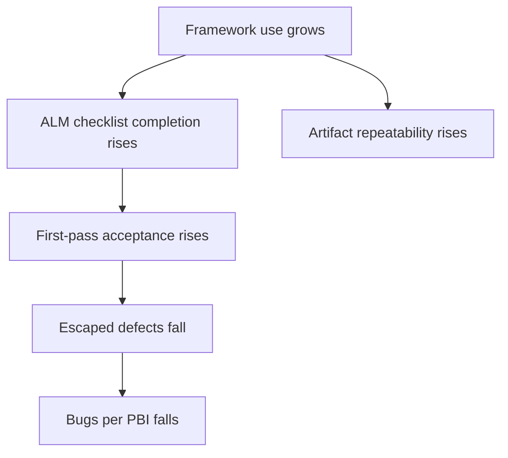
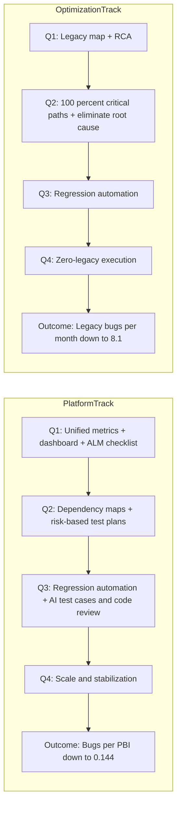
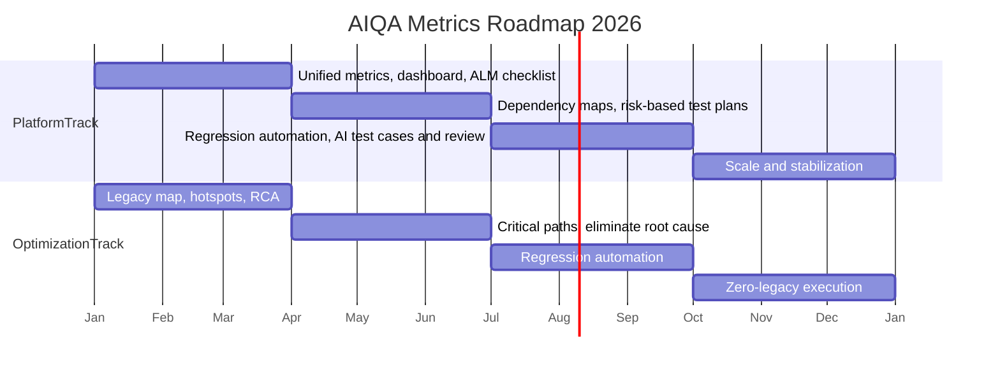

> **Supporting knowledge.** This document is a roadmap-aligned operational design for AIQA metrics. It is not a canonical contract and must not be read as proof that all described measurements are already automated.

# Unified Metrics For AIQA Framework

## 1. Purpose

This document replaces the earlier draft with a version that matches the actual `aiqa/` framework state and the 2026 QA roadmap.

It has two goals:

1. define a metric model that follows the roadmap quarter by quarter
2. keep claims honest with the current maturity of `aiqa/`

## 2. Boundary and truth model

Metrics in this document must respect the current framework reality:

- `aiqa/` is the canonical source of framework truth
- task folders hold execution evidence, not framework truth by default
- some metrics are measurable now from review-grade or validation-backed artifacts
- some metrics require lightweight process additions
- some roadmap targets remain planned and should not be presented as already automated

Current trust boundary:

- **Measurable now:** task artifacts, checklist presence, dependency maps, risk-based plans, documented evidence, validated YAML/index/impact-map artifacts
- **Measurable with lightweight process additions:** manual tagging in tasks, monthly rollups, dashboard consolidation
- **Not honestly claimable as automated today:** standing CI gates, full eval enforcement, broad runtime orchestration, fully automatic dashboarding from `aiqa/` alone

## 3. Roadmap as source of truth

The roadmap contains two outcome tracks and a sequence of enabling steps.

### Outcome tracks

| Track | Primary outcome metric | Baseline | 2026 target |
|---|---|---:|---:|
| Platform Team | `Bugs per PBI` | `0.295` | `0.144` |
| Optimization Team | `Legacy bugs per month` | `20` | `8.1` |

### Quarter-by-quarter roadmap

| Quarter | Platform Team roadmap step | Optimization Team roadmap step |
|---|---|---|
| Q1 | Unified QA metrics, QA dashboard, Mandatory ALM checklist | Legacy map and risk hotspots identified, Root Cause Analysis |
| Q2 | Dependency maps, Risk-based test plans | 100% critical paths covered, Eliminate root cause |
| Q3 | Regression automation (60-70%), AI test cases + code review | Regression automation |
| Q4 | Scale and stabilization | Zero-legacy execution |

## 4. Metrics aligned to the roadmap

### 4.1 Platform Team

| Quarter | Initiative | Metric | Formula / check | Source | Maturity |
|---|---|---|---|---|---|
| Q1 | Unified QA metrics | `Metric definition completeness` | `defined roadmap metrics / required roadmap metrics` | roadmap doc + metric registry | process-added |
| Q1 | QA dashboard | `Dashboard coverage` | `metrics visible in one reporting view / defined roadmap metrics` | dashboard sheet or report | process-added |
| Q1 | Mandatory ALM checklist | `ALM checklist completion rate` | `tasks with required artifacts / in-scope tasks` | task folders, ADO fields if present | measurable now |
| Q2 | Dependency maps | `Dependency map coverage` | `tasks with dependency map / tasks that require cross-repo or cross-module reasoning` | task folders | measurable now |
| Q2 | Risk-based test plans | `Risk-based plan coverage` | `tasks with explicit risk-based QA plan / in-scope tasks` | task folders | measurable now |
| Q3 | Regression automation (60-70%) | `Regression automation coverage` | `critical regression scenarios automated / critical regression scenarios identified` | task artifacts + test inventory | process-added |
| Q3 | AI test cases + code review | `AI-assisted review and test design adoption` | `tasks using AI-generated test design or review package / in-scope tasks` | task package tags or manual rollup | process-added |
| Q4 | Scale and stabilization | `Stable execution rate` | `roadmap steps operating without exceptional manual rescue / total active roadmap steps` | quarterly review | planned |

Primary outcome metric:

| Metric | Formula | Source | Frequency | Owner |
|---|---|---|---|---|
| `Bugs per PBI` | `confirmed bugs / closed PBIs` | ADO or equivalent tracker | monthly / quarterly | QA lead + team lead |

### 4.2 Optimization Team

| Quarter | Initiative | Metric | Formula / check | Source | Maturity |
|---|---|---|---|---|---|
| Q1 | Legacy map and risk hotspots identified | `Legacy hotspot mapping coverage` | `legacy areas mapped with hotspots / target legacy areas` | mapping docs, task artifacts | measurable now |
| Q1 | Root Cause Analysis | `RCA coverage` | `high-impact legacy defects with RCA / high-impact legacy defects` | RCA docs | measurable now |
| Q2 | 100% critical paths covered | `Critical path coverage` | `critical legacy paths with explicit test or review coverage / total critical legacy paths` | task docs, runbooks, tests | process-added |
| Q2 | Eliminate root cause | `Root cause elimination rate` | `RCA items closed by systemic fix / total RCA items accepted into backlog` | backlog + RCA docs | process-added |
| Q3 | Regression automation | `Legacy regression automation coverage` | `legacy critical scenarios automated / legacy critical scenarios selected for automation` | test inventory | process-added |
| Q4 | Zero-legacy execution | `Legacy manual intervention rate` | `legacy incidents needing ad hoc/manual workaround / period` | ops / QA review | planned |

Primary outcome metric:

| Metric | Formula | Source | Frequency | Owner |
|---|---|---|---|---|
| `Legacy bugs per month` | `confirmed legacy defects in period` | bug tracker / task rollup | monthly | Optimization lead |

## 5. Core metric dictionary

Only metrics that directly support the roadmap are kept in the MVP set.

| Metric | Why it exists in the roadmap | Type |
|---|---|---|
| `Bugs per PBI` | final quality outcome for the Platform track | outcome |
| `Legacy bugs per month` | final quality outcome for the Optimization track | outcome |
| `ALM checklist completion rate` | Q1 discipline and execution hygiene | leading |
| `Dependency map coverage` | Q2 impact awareness and cross-repo correctness | leading |
| `Risk-based plan coverage` | Q2 quality planning depth | leading |
| `Critical path coverage` | Q2 proof that the riskiest legacy paths are explicitly covered | leading |
| `RCA coverage` | Q1 move from fixes to understanding causes | leading |
| `Root cause elimination rate` | Q2 move from analysis to systemic closure | leading |
| `Regression automation coverage` | Q3 scaling and repeatability | capability |
| `AI-assisted review and test design adoption` | Q3 use of AI in test cases and review flows | capability |
| `Dashboard coverage` | Q1 visibility layer for the roadmap metrics | enablement |
| `Metric definition completeness` | Q1 governance that prevents fake metrics | enablement |

## 6. What changed vs the original draft

The original draft mixed three different ideas:

- framework effectiveness metrics
- generic QA KPI metrics
- a short-term rollout gantt

This version tightens the model:

1. the roadmap is treated as the primary structure
2. the two outcome tracks are separated
3. only roadmap-backed metrics are kept in the core set
4. each metric is tagged by current measurability
5. planned automation is no longer described as already available

## 7. Diagram validation

### 7.1 Does the old causal diagram match the roadmap?

**No, not fully.**

The old diagram was:

Why it does **not** match the roadmap strictly:

- it models only one narrow path toward `Bugs per PBI`
- it ignores the Optimization track completely
- it ignores roadmap steps such as dependency maps, risk-based test plans, root-cause elimination, regression automation, and scale/stabilization
- it includes `First-pass acceptance` and `Artifact repeatability`, which are useful operational metrics but are **not explicit roadmap steps**

### 7.2 Roadmap-aligned logic

The logic that matches the roadmap is a two-track progression:

This is the diagram that should be treated as aligned with the roadmap.

## 8. Gantt validation

### 8.1 Does the old rollout gantt match the roadmap?

**No, not strictly.**

Problems in the old gantt:

- it is an April-May implementation rollout, not a Q1-Q4 roadmap view
- `Сбор первичных данных (baseline)` starts before formal metric definition and before data-field setup
- it presents MVP dashboard rollout as if it were the roadmap itself, while the roadmap is yearly and capability-based

### 8.2 Correct interpretation

The old gantt can exist only as a **local MVP rollout plan**, not as the roadmap diagram.

If the document must match the roadmap strictly, the planning view should be quarter-based:

## 9. Recommended reporting shape

For practical reporting, keep one dashboard with three layers:

1. **Outcome layer**
   - `Bugs per PBI`
   - `Legacy bugs per month`
2. **Leading layer**
   - `ALM checklist completion rate`
   - `Dependency map coverage`
   - `Risk-based plan coverage`
   - `Critical path coverage`
   - `RCA coverage`
   - `Root cause elimination rate`
3. **Capability layer**
   - `Regression automation coverage`
   - `AI-assisted review and test design adoption`
   - `Dashboard coverage`
   - `Metric definition completeness`

## 10. Implementation guidance for the current framework state

### Measurable now

- checklist completion from task packages
- dependency map presence
- risk-based plan presence
- RCA presence
- legacy hotspot mapping presence

### Add with low process cost

- simple monthly rollup for `Bugs per PBI`
- simple monthly rollup for `Legacy bugs per month`
- manual tagging for AI-assisted review / test-design usage
- quarterly tracking of critical path coverage and automation coverage

### Keep as planned until evidence exists

- fully automatic dashboard refresh from `aiqa/`
- fully automatic quality gates for all roadmap steps
- zero-touch regression coverage accounting
- zero-legacy execution as a measured steady-state capability

## 11. Final recommendation

If this document is used as the framework metric baseline, then:

- use the **roadmap-aligned flowchart** as the primary logic diagram
- demote the old April-May gantt to a local rollout note or remove it
- treat `Bugs per PBI` and `Legacy bugs per month` as the only two primary outcome metrics
- keep all other metrics as enabling or leading metrics tied to explicit roadmap steps
