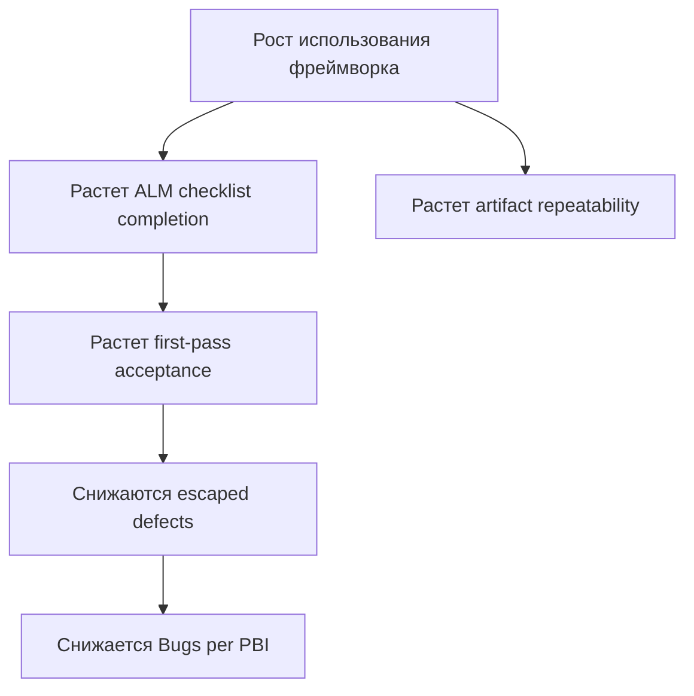
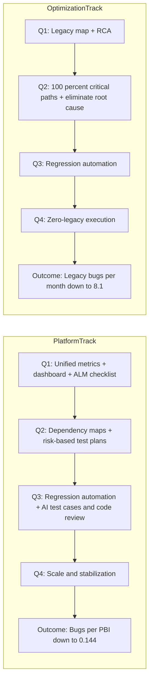
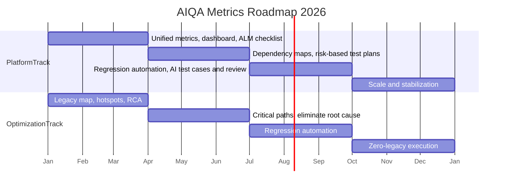

> **Поддерживающее знание.** Этот документ является roadmap-aligned операционным дизайном метрик AIQA. Он не является каноническим контрактом и не должен восприниматься как доказательство того, что все описанные измерения уже автоматизированы.

# Unified Metrics For AIQA Framework — RU

## 1. Назначение

Этот документ заменяет предыдущий черновик версией, которая соответствует фактическому состоянию `aiqa/` и QA roadmap на 2026 год.

У него две цели:

1. задать модель метрик, которая следует roadmap поквартально
2. сохранять честность формулировок относительно текущей зрелости `aiqa/`

## 2. Границы и модель истины

Метрики в этом документе должны учитывать реальные ограничения текущего фреймворка:

- `aiqa/` является каноническим источником истины по фреймворку
- task-папки содержат execution evidence, но по умолчанию не являются framework truth
- часть метрик уже можно измерять по артефактам уровня review-grade или validation-backed
- часть метрик требует легких процессных доработок
- часть целевых состояний roadmap пока остается planned и не должна подаваться как уже автоматизированная

Текущая граница доверия:

- **Измеримо уже сейчас:** task artifacts, наличие чеклистов, dependency maps, risk-based plans, задокументированные evidence, валидированные YAML/index/impact-map artifacts
- **Измеримо при легких процессных добавках:** ручная маркировка задач, ежемесячные rollup-отчеты, консолидация в dashboard
- **Нечестно заявлять как автоматизированное уже сейчас:** постоянные CI gates, полный eval enforcement, широкая runtime orchestration, полностью автоматический dashboarding только из `aiqa/`

## 3. Roadmap как источник истины

Roadmap содержит два outcome-трека и последовательность enabling steps.

### Outcome-треки

| Трек | Основная outcome-метрика | Базовое значение | Цель 2026 |
|---|---|---:|---:|
| Platform Team | `Bugs per PBI` | `0.295` | `0.144` |
| Optimization Team | `Legacy bugs per month` | `20` | `8.1` |

### Поквартальная структура roadmap

| Квартал | Шаг roadmap для Platform Team | Шаг roadmap для Optimization Team |
|---|---|---|
| Q1 | Unified QA metrics, QA dashboard, Mandatory ALM checklist | Legacy map and risk hotspots identified, Root Cause Analysis |
| Q2 | Dependency maps, Risk-based test plans | 100% critical paths covered, Eliminate root cause |
| Q3 | Regression automation (60-70%), AI test cases + code review | Regression automation |
| Q4 | Scale and stabilization | Zero-legacy execution |

## 4. Метрики, выровненные по roadmap

### 4.1 Platform Team

| Quarter | Initiative | Metric | Formula / check | Source | Maturity |
|---|---|---|---|---|---|
| Q1 | Unified QA metrics | `Metric definition completeness` | `defined roadmap metrics / required roadmap metrics` | roadmap doc + metric registry | process-added |
| Q1 | QA dashboard | `Dashboard coverage` | `metrics visible in one reporting view / defined roadmap metrics` | dashboard sheet or report | process-added |
| Q1 | Mandatory ALM checklist | `ALM checklist completion rate` | `tasks with required artifacts / in-scope tasks` | task folders, ADO fields if present | measurable now |
| Q2 | Dependency maps | `Dependency map coverage` | `tasks with dependency map / tasks that require cross-repo or cross-module reasoning` | task folders | measurable now |
| Q2 | Risk-based test plans | `Risk-based plan coverage` | `tasks with explicit risk-based QA plan / in-scope tasks` | task folders | measurable now |
| Q3 | Regression automation (60-70%) | `Regression automation coverage` | `critical regression scenarios automated / critical regression scenarios identified` | task artifacts + test inventory | process-added |
| Q3 | AI test cases + code review | `AI-assisted review and test design adoption` | `tasks using AI-generated test design or review package / in-scope tasks` | task package tags or manual rollup | process-added |
| Q4 | Scale and stabilization | `Stable execution rate` | `roadmap steps operating without exceptional manual rescue / total active roadmap steps` | quarterly review | planned |

Основная outcome-метрика:

| Метрика | Формула | Источник | Частота | Владелец |
|---|---|---|---|---|
| `Bugs per PBI` | `confirmed bugs / closed PBIs` | ADO или эквивалентный трекер | ежемесячно / ежеквартально | QA lead + team lead |

### 4.2 Optimization Team

| Quarter | Initiative | Metric | Formula / check | Source | Maturity |
|---|---|---|---|---|---|
| Q1 | Legacy map and risk hotspots identified | `Legacy hotspot mapping coverage` | `legacy areas mapped with hotspots / target legacy areas` | mapping docs, task artifacts | measurable now |
| Q1 | Root Cause Analysis | `RCA coverage` | `high-impact legacy defects with RCA / high-impact legacy defects` | RCA docs | measurable now |
| Q2 | 100% critical paths covered | `Critical path coverage` | `critical legacy paths with explicit test or review coverage / total critical legacy paths` | task docs, runbooks, tests | process-added |
| Q2 | Eliminate root cause | `Root cause elimination rate` | `RCA items closed by systemic fix / total RCA items accepted into backlog` | backlog + RCA docs | process-added |
| Q3 | Regression automation | `Legacy regression automation coverage` | `legacy critical scenarios automated / legacy critical scenarios selected for automation` | test inventory | process-added |
| Q4 | Zero-legacy execution | `Legacy manual intervention rate` | `legacy incidents needing ad hoc/manual workaround / period` | ops / QA review | planned |

Основная outcome-метрика:

| Метрика | Формула | Источник | Частота | Владелец |
|---|---|---|---|---|
| `Legacy bugs per month` | `confirmed legacy defects in period` | bug tracker / task rollup | ежемесячно | Optimization lead |

## 5. Базовый словарь метрик

В MVP-наборе оставлены только те метрики, которые напрямую поддерживают roadmap.

| Метрика | Зачем она нужна в roadmap | Тип |
|---|---|---|
| `Bugs per PBI` | финальная outcome-метрика для Platform track | outcome |
| `Legacy bugs per month` | финальная outcome-метрика для Optimization track | outcome |
| `ALM checklist completion rate` | Q1: дисциплина исполнения и execution hygiene | leading |
| `Dependency map coverage` | Q2: awareness по impact и корректность cross-repo reasoning | leading |
| `Risk-based plan coverage` | Q2: глубина quality planning | leading |
| `Critical path coverage` | Q2: подтверждение, что самые рискованные legacy paths явно покрыты | leading |
| `RCA coverage` | Q1: переход от фиксов к пониманию причин | leading |
| `Root cause elimination rate` | Q2: переход от анализа к системному закрытию причин | leading |
| `Regression automation coverage` | Q3: масштабируемость и повторяемость | capability |
| `AI-assisted review and test design adoption` | Q3: использование AI в test cases и review flows | capability |
| `Dashboard coverage` | Q1: слой видимости для roadmap-метрик | enablement |
| `Metric definition completeness` | Q1: governance, не дающий скатиться в fake metrics | enablement |

## 6. Что изменилось по сравнению с исходным черновиком

Исходный черновик смешивал три разные идеи:

- метрики эффективности фреймворка
- общие QA KPI-метрики
- краткосрочный rollout gantt

В этой версии модель ужесточена:

1. roadmap используется как первичная структура
2. две outcome-линии разделены
3. в core set оставлены только roadmap-backed metrics
4. каждая метрика помечена по текущей измеримости
5. planned automation больше не описывается как уже существующая

## 7. Проверка диаграммы

### 7.1 Соответствует ли старая причинно-следственная диаграмма roadmap?

**Нет, не полностью.**

Старая диаграмма была такой:

Почему она **не соответствует roadmap строго**:

- она моделирует только один узкий путь к `Bugs per PBI`
- она полностью игнорирует Optimization track
- она игнорирует такие roadmap-steps, как dependency maps, risk-based test plans, root-cause elimination, regression automation и scale/stabilization
- в ней есть `First-pass acceptance` и `Artifact repeatability`, которые полезны как operational metrics, но **не являются явными шагами roadmap**

### 7.2 Логика, выровненная по roadmap

Логика, которая соответствует roadmap, должна показывать двухтрековую прогрессию:

Именно эту диаграмму нужно считать выровненной по roadmap.

## 8. Проверка gantt-диаграммы

### 8.1 Соответствует ли старый rollout gantt roadmap?

**Нет, не строго.**

Проблемы старого gantt:

- это rollout-план на апрель-май, а не roadmap view на Q1-Q4
- `Сбор первичных данных (baseline)` начинается раньше формального определения метрик и раньше настройки data-fields
- MVP dashboard rollout подан так, будто он и есть roadmap, хотя roadmap годовой и capability-based

### 8.2 Корректная интерпретация

Старый gantt может существовать только как **локальный MVP rollout plan**, но не как roadmap-диаграмма.

Если документ должен строго соответствовать roadmap, то planning view должен быть квартальным:

## 9. Рекомендуемая форма отчетности

Для практической отчетности лучше держать один dashboard из трех слоев:

1. **Outcome layer**
   - `Bugs per PBI`
   - `Legacy bugs per month`
2. **Leading layer**
   - `ALM checklist completion rate`
   - `Dependency map coverage`
   - `Risk-based plan coverage`
   - `Critical path coverage`
   - `RCA coverage`
   - `Root cause elimination rate`
3. **Capability layer**
   - `Regression automation coverage`
   - `AI-assisted review and test design adoption`
   - `Dashboard coverage`
   - `Metric definition completeness`

## 10. Практическое внедрение с учетом текущего состояния фреймворка

### Что можно измерять уже сейчас

- completion чеклистов по task packages
- наличие dependency maps
- наличие risk-based plans
- наличие RCA
- наличие legacy hotspot mapping

### Что можно добавить с низкой процессной стоимостью

- простой monthly rollup для `Bugs per PBI`
- простой monthly rollup для `Legacy bugs per month`
- ручная маркировка задач для AI-assisted review / test-design usage
- квартальный учет critical path coverage и automation coverage

### Что нужно оставлять в planned, пока нет evidence

- полностью автоматическое обновление dashboard из `aiqa/`
- полностью автоматические quality gates для всех roadmap steps
- zero-touch расчет regression coverage
- zero-legacy execution как уже измеряемую steady-state capability

## 11. Финальная рекомендация

Если этот документ используется как baseline по метрикам фреймворка, то:

- использовать **roadmap-aligned flowchart** как основную логическую диаграмму
- понизить старый April-May gantt до статуса local rollout note или убрать его
- считать `Bugs per PBI` и `Legacy bugs per month` единственными двумя primary outcome metrics
- все остальные метрики держать как enabling или leading metrics, привязанные к явным roadmap steps
