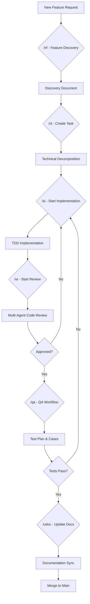

> **Supporting reference (Step 5.5B).** Non-canonical: operational inventory and narrative, not framework contract truth. Canonical layer: `aiqa/MANIFEST.md`, `aiqa/STRUCTURE.md`. Migrated from `everything/AI-frame-docs/`.

# AI Framework Documentation for DevReps Workspace

## Overview

The DevReps workspace contains an AI-powered development framework designed to automate and enhance software development workflows across multiple projects: AMS (Account Management System), ETNA_TRADER (Trading Platform), ServerlessIntegrations, and QA automation.

The framework consists of specialized AI skills, agents, and tools that handle feature discovery, technical decomposition, implementation, code review, testing, and documentation.

## Architecture

### Projects Overview

- **AMS**: Account Management System (.NET, C#) - Handles account operations, integrations with clearinghouses and brokers.
- **ETNA_TRADER**: Trading Platform (.NET backend + TypeScript frontend) - Core trading system with OMS, streaming, and ACAT frontend.
- **ServerlessIntegrations**: AWS Lambda-based integrations for reports and data processing.
- **QA**: Test automation framework (C#, NUnit/xUnit, Playwright, Pytest).

### AI Framework Components

The AI framework is organized into skills and agents:

#### Skills

Skills are specialized workflows triggered by specific commands. Each skill has a defined purpose, agent assignment, and output location.

| Skill | Trigger | Purpose | Agent | Output Path |
|-------|---------|---------|-------|-------------|
| `/nf` | Feature discovery | Interview + spec shaping | — | `tasks/task-<date>-<name>/discovery-<name>.md` |
| `/ct` | Create task | Technical decomposition, TDD plan | — | `tasks/task-<date>-<name>/tech-decomposition-<name>.md` |
| `/si` | Start implementation | TDD execution following task doc | developer-agent | Inline + code edits |
| `/sr` | Start review | Pre-merge multi-agent code review | code-quality-reviewer + 4 others | `tasks/task-<date>-<name>/code-review-<name>.md` |
| `/qa` | QA workflow | Test plan / TCs / automation / architecture / coverage | senior-qa-engineer | `tasks/task-<date>-<name>/test-plan-*.md`, `test-cases-*.md` |
| `/qa-orchestrator` | QA with context build | Context bundle builder → routes to /qa | senior-qa-engineer | Same as /qa |
| `/udoc` | Update docs | Post-implementation doc sync | docs-updater | Edits to `docs/` |
| `/parallelization` | Parallel work | Split across isolated workers | — | Per-worker task outputs |
| `/ai-settings` | Quality check | Release notes / AC / style / tests / pre-commit | — | Inline structured output |
| `/skill-creator` | New skill | Guide for creating ETNA skills | — | `.claude/skills/<name>/skill.md` |
| `atlas-status-req` | Atlas QA | Query Atlas account request status via Legit JWT | — | Inline curl examples |
| `legit-api-token-jwt` | APEX auth | Build Legit JWT / JWS for APEX API | — | Inline scripts |

#### Agents

Agents are specialized AI workers grouped by function:

| Agent | Group | Purpose | Used by |
|-------|-------|---------|---------|
| `senior-qa-engineer` | qa-agents | Automation + docs + test architecture for trading | `/qa`, `/qa-orchestrator` |
| `developer-agent` | automation-agents | Implementation execution | `/si` |
| `automated-quality-gate` | automation-agents | Automated quality checks | `/sr` |
| `senior-architecture-reviewer` | automation-agents | Architecture review | `/sr` |
| `code-quality-reviewer` | code-review-agents | Code quality analysis | `/sr` |
| `documentation-accuracy-reviewer` | code-review-agents | Docs accuracy check | `/sr` |
| `performance-reviewer` | code-review-agents | Performance analysis | `/sr` |
| `security-code-reviewer` | code-review-agents | Security review | `/sr` |
| `test-coverage-reviewer` | code-review-agents | Test coverage analysis | `/qa` Mode E |
| `plan-reviewer` | tasks-validators-agents | Review task plans | Internal |
| `task-decomposer` | tasks-validators-agents | Decompose tasks | `/ct` |
| `task-pm-validator` | tasks-validators-agents | PM-level validation | Internal |
| `task-splitter` | tasks-validators-agents | Split large tasks | Internal |
| `api-design-agent` | trading-app-agents | API design for trading | `/ct`, `/si` |
| `db-migration-agent` | trading-app-agents | DB migration patterns | `/si`, `/sr` |
| `trading-ui-planning-agent` | trading-app-agents | UI planning (ACAT) | `/ct` |
| `changelog-generator` | wf-agents | Generate changelog | `/udoc` |

## Workflow Diagrams

### Main Development Workflow



### QA Workflow Modes

```mermaid
flowchart TD
    A[/qa Command] --> B{Mode Selection}
    B --> C[Mode A: Test Plan]
    B --> D[Mode B: Test Cases]
    B --> E[Mode C: Automation]
    B --> F[Mode D: Architecture]
    B --> G[Mode E: Coverage]
    C --> H[Generate Plan Document]
    D --> I[Generate Test Cases]
    E --> J[Create Automation Scripts]
    F --> K[Design Test Architecture]
    G --> L[Analyze Coverage Gaps]
```

### Code Review Process

```mermaid
flowchart TD
    A[/sr Command] --> B[Automated Quality Gate]
    B --> C[Code Quality Reviewer]
    B --> D[Architecture Reviewer]
    B --> E[Performance Reviewer]
    B --> F[Security Reviewer]
    B --> G[Documentation Reviewer]
    C --> H[Individual Reviews]
    D --> H
    E --> H
    F --> H
    G --> H
    H --> I[Consolidated Report]
    I --> J[Feedback to Developer]
```

## Configuration and Sync

### Skills Location
- **Canonical**: `_ai-tools-export/.claude/skills/` 
- **Synced to**: `ETNA_TRADER/.claude/skills/`
- **Sync Script**: `scripts/sync-configs.js`

### Agents Configuration
Agents are defined in `.claude/` directories with specialized prompts and capabilities for each project domain.

### Quality Gates
- **AI Settings**: Runs git diff and checks changed files for release notes, acceptance criteria, style alignment, unit test opportunities, and pre-commit validation.
- **Pre-commit Checks**: Automated validation before commits.

## File Structure in Archive

The provided ZIP archive contains the following structure:

```
ai-framework.zip/
├── serverlessintegration/  # (Empty - no AI-specific files)
├── AMS/                    # (Empty - no AI-specific files)
├── ETNA_TRADER/
│   ├── _ai-tools-export/   # Exported AI tools and configurations
│   ├── .claude/           # Claude AI skills and agents
│   ├── AGENTS.md          # Project architecture documentation
│   ├── CLAUDE.md          # Claude-specific configuration
│   ├── FRAMEWORK_INDEX.md # Framework component index
│   ├── scripts/           # AI workflow scripts
│   └── docs/              # Project documentation
└── qa/
    └── AI-framework-4-myMommy/  # QA-specific AI framework
```

## Usage Instructions

1. **Extract the ZIP archive** to access all AI framework components.
2. **Review FRAMEWORK_INDEX.md** for quick reference of all skills and agents.
3. **Read individual SKILL.md files** in `.claude/skills/` for detailed workflow instructions.
4. **Use sync scripts** in `scripts/` to maintain configuration consistency across projects.

## Integration Points

- **Git Workflow**: Skills integrate with git diff for change analysis.
- **Task Management**: Tasks are stored in `tasks/` directory with structured naming.
- **Documentation**: Automatic sync between implementation and docs.
- **Testing**: Integrated test generation and coverage analysis.

This framework enables automated, high-quality software development with consistent patterns across all DevReps projects.</content>
<parameter name="filePath">d:\DevReps\ai-framework-documentation.md