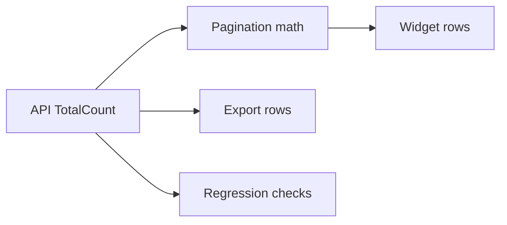

# Presentation outline — AI QA Framework pilot

## Purpose

Эта презентация должна показывать framework не как набор abstract docs, а как practical evidence-first layer на одном реальном bug: `bug-228299-leaderboard-totalcount`.

## Core storyline

Лучший narrative для этой презентации:

1. Показать реальную проблему.
2. Объяснить, почему именно эта задача выбрана как pilot.
3. Показать tangible package, который framework собрал по задаче.
4. Разложить, что именно framework дал по dependency mapping, risk hotspots и QA planning.
5. Завершить честной границей: что pilot уже доказывает и чего пока не доказывает.

## Recommended deck

Оптимально: 10 основных слайдов и 2 appendix slides.

### Slide 1. Title

**Title:** `AI QA Framework Pilot: Leaderboard TotalCount`

**Key message:** это не обзор framework в целом, а показ одной реальной задачи, разобранной evidence-first.

**Content:**

- one real bug
- one practical pilot package
- one honest maturity boundary

**Suggested visual:**

- title slide с коротким подзаголовком:
  `One real bug. One evidence-based package. No oversell.`

**Sources:**

- `short-summary.md`

### Slide 2. Why This Task

**Key message:** задача выбрана не случайно, а потому что она already decomposed, in-scope и хорошо доказуема.

**Content:**

- existing task package already exists
- task is inside canonical scope
- explicit impact rule exists
- there is code diff, repro, automation and run evidence

**Suggested visual:**

- 4-card slide: `Existing package`, `In scope`, `Impact rule`, `Evidence`

**Sources:**

- `short-summary.md`
- `evidence-notes.md`

### Slide 3. The Real Bug

**Key message:** проблема реальная и понятная бизнесу: API count расходился с тем, что видели UI и export.

**Content:**

- `TotalCount` from API was higher than actual visible/exported rows
- widget and export showed fewer records
- repro used an account with a no-quote position
- before fix: count and pages wrong
- after fix: count aligned with visible rows

**Suggested visual:**

- one left/right block: `Before fix` vs `After fix`
- optional screenshot strip from bug discussion

**Sources:**

- `README.md`
- `evidence-notes.md`

### Slide 4. What The Framework Produced

**Key message:** framework output here is a tangible package, not just a chat explanation.

**Content:**

- `short-summary.md`
- `dependency-map.md`
- `legacy-hotspots.md`
- `risk-based-qa-plan.md`
- `ai-review-test-design.md`
- `evidence-notes.md`

**Suggested visual:**

- package view with 6 artifacts as one deliverable bundle

**Sources:**

- `pilot-package/`

### Slide 5. Dependency Map

**Key message:** framework turned one bug into a structured change surface with confirmed vs inferred links.

**Content:**

- confirmed canonical scope: `ETNA_TRADER`
- confirmed impact rule: `leaderboard-accounts-balances-surface`
- confirmed changed files from PR branch
- confirmed consumer chain: API -> pagination -> UI -> export -> tests
- explicit `inferred/unknown` boundaries remain

**Suggested visual:**

- 2-column layout:
  - `Confirmed`
  - `Still inferred`

**Suggested mini-diagram:**

**Sources:**

- `dependency-map.md`
- `impact-map.yaml`

### Slide 6. Root Cause Narrowing

**Key message:** framework did not claim full RCA, but it narrowed the problem with evidence.

**Content:**

- missing quote is the strongest repro-backed trigger
- old mismatch mechanism is code-confirmed
- `RiskManager` returns only non-null balance entries
- `BalanceManager` zero-fills `QuoteException` attributes instead of always dropping the whole balance
- remaining gap: exact failing path on the broken dataset

**Suggested visual:**

- 3 bands:
  - `Confirmed`
  - `Strongest hypothesis`
  - `Still unknown`

**Sources:**

- `short-summary.md`
- `dependency-map.md`
- `legacy-hotspots.md`
- `evidence-notes.md`

### Slide 7. Risk Hotspots

**Key message:** framework exposes not only the bug, but the fragile areas around it.

**Content:**

- response invariants
- field consistency
- API/UI parity
- rank and pagination stability
- service contract change around `GetBalances`
- candidate hotspot: broken balance-generation path for incomplete market data

**Suggested visual:**

- table with 2 columns:
  - `Confirmed hotspots`
  - `Candidate hotspots`

**Sources:**

- `legacy-hotspots.md`

### Slide 8. Risk-Based QA Plan

**Key message:** framework produced a concrete QA plan, not just analysis.

**Content:**

- high-risk checks
- manual required checks
- checks available now
- later automation candidates

**Suggested visual:**

- 4 quadrant slide:
  - `High risk now`
  - `Manual required`
  - `Already automatable`
  - `Good next automation`

**Sources:**

- `risk-based-qa-plan.md`

### Slide 9. AI Review / Test Design Output

**Key message:** one task generated reusable review logic, not only task-local notes.

**Content:**

- review questions framework should ask
- assumptions it should block
- reusable prompts
- candidate reusable rules

**Suggested visual:**

- left: `Questions the framework asks`
- right: `Rules/prompts reusable later`

**Sources:**

- `ai-review-test-design.md`

### Slide 10. Honest Conclusion

**Key message:** the pilot proves something useful now, but not everything.

**Content:**

**Already proves:**

- task selection inside real framework scope
- dependency mapping with evidence boundaries
- hotspot identification
- practical QA planning
- reusable AI review/test design prompts

**Does not prove yet:**

- full automation platform
- complete internal RCA
- complete cross-repo dependency graph
- automation-grade enforcement

**Suggested visual:**

- `Already proves` / `Does not prove yet`

**Sources:**

- `evidence-notes.md`
- `artifact-maturity-policy.md`

## Appendix

### Appendix A. Code Anchors

Use this only if someone asks “where exactly in code?”.

**Content:**

- key files from `dependency-map.md`
- `AccountsWithBalancesService`
- `RiskManager`
- `BalancesResult`
- controller/export mapping files

**Sources:**

- `dependency-map.md`

### Appendix B. Evidence Ledger

Use this if someone challenges confidence level.

**Content:**

- `strong`
- `weak`
- `needs validation`

**Sources:**

- `evidence-notes.md`

## Presentation rules

- Keep one message per slide.
- Do not start with framework architecture.
- Start with the real bug.
- Use `Confirmed` / `Unknown` framing often.
- Do not sell this as full automation.
- Show one or two code anchors only when asked.

## Suggested time split

- Slides 1-3: 2-3 minutes
- Slides 4-9: 6-8 minutes
- Slide 10: 1 minute
- Appendix: only for Q&A

## Short presenter talk track

- We picked one real bug, not a synthetic demo.
- The framework selected it as an in-scope, evidence-rich pilot.
- It produced a concrete package: dependency map, hotspots, QA plan, review prompts, evidence ledger.
- It narrowed the root cause without pretending to have full RCA.
- It showed useful practical value already.
- It also made the remaining unknowns explicit instead of hiding them.
