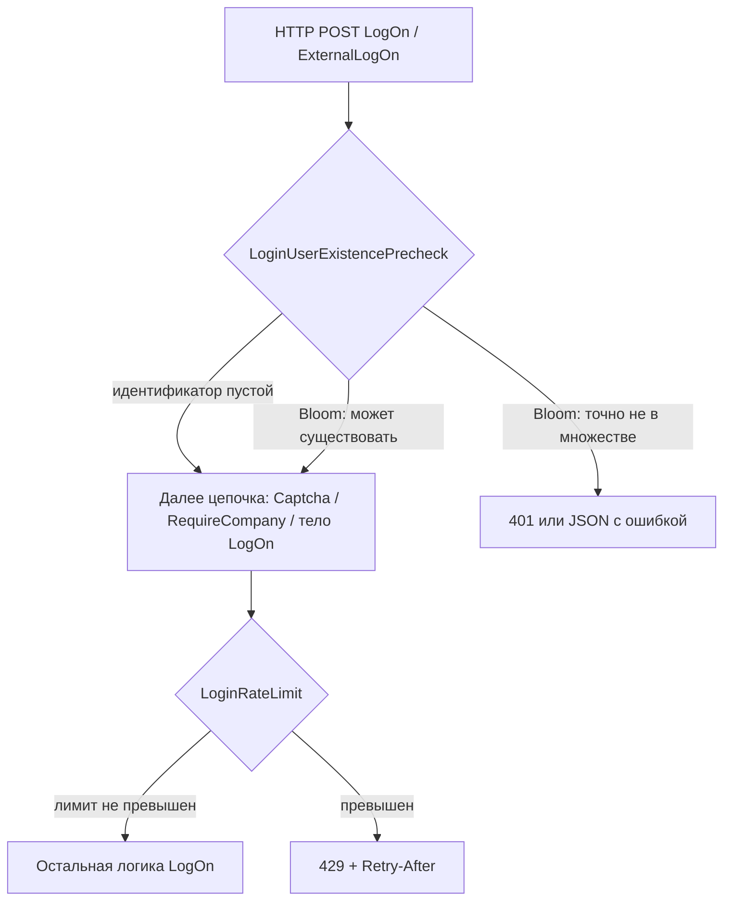

# FrontOffice — защита логона и снижение шторма к БД (GetPolicyRules)

**Версия документа:** 1.0  
**Дата:** 2026-04-09  
**Актор по умолчанию:** QA (с секциями для reviewer / developer)  
**Канон:** [`aiqa/MANIFEST.md`](../../MANIFEST.md)  
**Шаблон handoff:** [`aiqa/templates/task-handoff-and-impact-prompt.md`](../../templates/task-handoff-and-impact-prompt.md)

---

## Document control

| Поле | Значение |
|------|----------|
| PR (Azure DevOps) | [15493](https://dev.azure.com/etnasoft/ETNA_TRADER/_git/19afa09e-4f75-4f60-ad0c-b3357693c4ef/pullrequest/15493) |
| Ветка | `feature/ddos-prot` (также: `feature/ddos-prot-1.2.186-release` на remote) |
| Репозиторий | `ETNA_TRADER` |
| База сравнения в workspace | `git diff HEAD...origin/feature/ddos-prot` (локальный `HEAD` может отличаться от целевой базы PR) |
| ET.Wiki | **Нет локальной копии** в workspace — ссылки на wiki-страницы приложить отдельно при появлении |

### Классификация утверждений

В документе используются метки:

- **[ТИКЕТ]** — из описания задачи / наблюдений в поле (не проверено репозиторием).
- **[PR]** — подтверждено diff ветки `origin/feature/ddos-prot` относительно локального `HEAD`.
- **[ГИПОТЕЗА]** — логическое следствие или предположение, требующее trace/измерений.
- **[УТОЧНИТЬ]** — обязательное внешнее подтверждение (prod SLA, совпадение PR с веткой, исходники пакета Policy).

---

## 1. Executive summary

### 1.1 Бизнес-контекст **[ТИКЕТ]**

В среде **Regal LP (FrontOffice)** зафиксировано существенно более медленное переключение аккаунта по сравнению с **Sogo** (порядок: секунды vs сотни миллисекунд). Параллельно в трассировке/SQL профилировании наблюдалось большое число однотипных обращений к хранимой процедуре вида **`GetPolicyRules`** (в тикете упоминалось **69** идентичных обращений). От разработки поступал контекст об **инциденте DDoS через функцию логона FO** и работе над **protection guard**.

### 1.2 Техническая суть изменений **[PR]**

Ветка `feature/ddos-prot` вносит изменения **в слой Etna.Web (ASP.NET MVC)**:

1. **Ограничение частоты** HTTP-запросов к действиям логона (**rate limiting**) с ответом **HTTP 429** и заголовком **`Retry-After`**.
2. **Предпроверка существования пользователя** до выполнения основной логики логона с использованием **Bloom filter** в памяти процесса, заполняемого из списка пользователей при старте и обновляемого при создании/изменении пользователя.
3. **Ранний выход** в `UserManager` при «логин/email точно отсутствует в множестве известных логинов/email» — без обращения к `GetUserByLoginOrEmail` в типичном сценарии отсутствия пользователя.

### 1.3 Ключевой вывод для QA

- Защита **привязана к MVC-эндпоинтам** `LogOn` и `ExternalLogOn`.  
- **Прямого** изменения кода, который бы уменьшил число вызовов политик/процедуры `GetPolicyRules` при **одном успешном** логоне или при **смене контекста аккаунта** после входа, в рассмотренном diff **не обнаружено**.  
- Ожидаемый эффект на нагрузку: **меньше полноценных попыток логона** при атаке/бруте и **меньше обращений к БД за пользователем** для заведомо несуществующих идентификаторов (после готовности Bloom filter).  
- Связь с симптомом «медленное переключение аккаунта» и «шторм GetPolicyRules» — **частично косвенная** **[ГИПОТЕЗА]**; если узкое место — **не MVC LogOn**, этот PR может **не** закрыть наблюдение по Regal LP полностью **[УТОЧНИТЬ]**.

---

## 2. Task summary

### 2.1 Формулировка задачи (plain language)

Защитить FrontOffice от злоупотребления механизмом логона (массовые запросы), снизить деградацию UX и нагрузку на БД, не ломая легитимные сценарии входа и отображения прав/политик.

### 2.2 Технический интент **[PR]**

| Цель | Реализация в PR |
|------|-----------------|
| Ограничить частоту логонов с одного IP / по паре IP+логин | `LoginRateLimitAttribute`, счётчики в `MemoryCache` |
| Не выполнять тяжёлый путь для несуществующих логинов | `LoginUserExistencePrecheckAttribute` + Bloom + ранний выход в `UserManager` |
| Не блокировать легитимный трафик до инициализации фильтра | Bloom: пока не готов — «все могут существовать» (безопасный режим) |

### 2.3 Что задача **не** делает **[PR]**

- Не вводит конфигурируемые лимиты через `web.config` / DB — числовые пороги **зашиты** в атрибутах (см. раздел 4).
- Не изменяет **WebAPI/Owin** pipeline (`AuthenticationPipeline`, `ISecurityPolicyProvider`) в показанном diff.
- Не содержит строки или вызовов **`GetPolicyRules`** в репозитории `ETNA_TRADER` (поиск по workspace).

---

## 3. Changed surface (детально)

### 3.1 Файлы и роли

| Путь (от корня `ETNA_TRADER`) | Тип | Назначение |
|-------------------------------|-----|------------|
| `src/Etna.Web/Etna.Web.User/Controllers/UserControllerBase.cs` | Изменён | Точки подключения фильтров на `LogOn` / `ExternalLogOn` |
| `src/Etna.Web/Etna.Web/ActionAttributes/LoginRateLimitAttribute.cs` | Новый | Rate limit, 429, Retry-After |
| `src/Etna.Web/Etna.Web/ActionAttributes/LoginUserExistencePrecheckAttribute.cs` | Новый | Ранний отказ по Bloom |
| `src/Etna.Web/Etna.Web/User/UserLoginBloomFilter.cs` | Новый | In-memory Bloom filter |
| `src/Etna.Web/Etna.Web/User/UserManager.cs` | Изменён | Инициализация Bloom, обновление при CRUD пользователя, `ValidateUser`, `GetUserId` |
| `src/Etna.Web/Etna.Web/Etna.Web.csproj` | Изменён | `System.Runtime.Caching`, compile includes |

### 3.2 Точки подключения в `UserControllerBase` **[PR]**

- **`LogOn`**: добавлены атрибуты **`[LoginUserExistencePrecheck]`** и **`[LoginRateLimit]`** (параметры по умолчанию), **перед** существующими `[Captcha]` и `[RequireCompany]` (порядок в файле PR; фактический порядок выполнения фильтров см. 3.3).
- **`ExternalLogOn`**: **`[LoginUserExistencePrecheck(asJson: true)]`**, **`[LoginRateLimit(asJson: true, enablePerIpLimit: false)]`**.

### 3.3 Порядок выполнения MVC action filters **[PR + общее поведение ASP.NET MVC]**

- У `LoginUserExistencePrecheckAttribute` задано **`Order = -1`** (выполняется раньше фильтров с большим порядком).
- У `LoginRateLimitAttribute` задано **`Order = 1`**.
- У остальных атрибутов (`Captcha`, и т.д.) порядок по умолчанию — **0**, если не переопределён **[УТОЧНИТЬ]** по конкретной версии MVC и наличию `Order` у `CaptchaAttribute` в вашей ветке.

Рекомендуемая проверка: при необходимости — точечный тест/лог с `OnActionExecuting` для фиксации последовательности на стенде.

### 3.4 Диаграмма потока (логическая)

---

## 5. Связь с наблюдением «GetPolicyRules» и медленным переключением аккаунта

### 5.1 Имя процедуры **[ТИКЕТ]**

В тексте задачи указана хранимая процедура **`GetPolicyRules`** с параметрами `@userId`, `@groupId`, `@action`, `@policyName`. В исходниках **`ETNA_TRADER` в workspace строка `GetPolicyRules` не найдена** — вероятно, процедура вызывается из слоя данных/пакета **вне данного репозитория** или из SQL-скриптов, не проиндексированных в поиске.

### 5.2 Где в коде ETNA_TRADER фигурируют политики при аутентификации

**WebAPI (Owin)** — путь **не** изменён данным PR, но важен для трассируемости **[факт из репозитория]**:

Файл `src/Etna.Trader/Etna.Trader.WebApi.Core/RulesAuthentication/Handlers/AuthenticationPipeline.cs` после проверки пароля вызывает:

- `ISecurityPolicyProvider.TryPassLoginRules(user, company.DefaultGroupId, password, ...)`
- `ISecurityPolicyProvider.GetAuthenticationPolicies(user, company.DefaultGroupId, password)`

Реализация интерфейса подключается через `SecurityPolicyFactory.Get()` → сборка **`Etna.Trading.Web.Policy`** (исходники в данном workspace не разложены).

**MVC `UserControllerBase.LogOn`** (текущий `HEAD` без PR) при валидной модели вызывает, среди прочего, `PolicyProvider.GetBeforeAuthenticationPolicies(...)` — отдельный путь от WebAPI, но тоже «политики до/вокруг аутентификации».

### 5.3 Как PR может влиять на число обращений к политикам **[ГИПОТЕЗА]**

| Механизм | Ожидаемый эффект на БД/политики |
|----------|--------------------------------|
| Rate limit на POST логона | Меньше **параллельных** полных попыток входа → меньше каскадных вызовов политик **на стороне атаки** |
| Bloom + precheck + ранний выход в `ValidateUser` / `GetUserId` | Для **несуществующих** логинов — раньше выход без загрузки пользователя; **цепочка политик для несуществующего пользователя** может не выполняться или сокращаться **[УТОЧНИТЬ]** по фактическому стеку вызовов |
| Отсутствие изменений в `AuthenticationPipeline` | Любой логон/токен через **WebAPI** без новых guard’ов в этом PR |

### 5.4 Медленное «переключение аккаунта» **[ТИКЕТ] + [ГИПОТЕЗА]**

Если переключение аккаунта в Regal LP реализовано **не** через повторный POST на MVC `LogOn`, а через **API-сессию**, смену контекста или множественные фоновые запросы после входа, то **данный PR может не уменьшить** время переключения. Это **обязательный** предмет отдельной трассировки (см. open questions).

---

## 6. Draft acceptance criteria

| ID | Критерий | Тип | Проверка |
|----|----------|-----|----------|
| **AC0** | Замедление Regal LP относительно baseline воспроизводимо | [ТИКЕТ] | Замеры до/после на согласованной сборке |
| **A1** | Легитимный `LogOn` / `ExternalLogOn` завершается без лишних **401/429** | [PR] + продукт | Happy path, разные роли |
| **A2** | При превышении лимитов — **429**, заголовок **Retry-After**, тело как в спецификации | [PR] | Негативный сценарий |
| **A3** | Несуществующий логин: при готовом Bloom — корректное сообщение; **без** лишних round-trip к БД за пользователем | [PR] | SQL trace / профайлер **[УТОЧНИТЬ]** |
| **A4** | Существующий пользователь: права/политики и captcha-логика не регрессируют | [продукт] | Smoke набора разрешений |
| **A5** | Поведение задокументировано: лимиты **30/60**, **5/60**, особенности `ExternalLogOn` | [PR] | Этот документ; конфиг-файлов нет |
| **A6** | Стартовая инициализация Bloom не рушит процесс при ошибке | [PR] | Логи при сбое `GetUsers()` |

Критерии, которые **нельзя** подтвердить без внешних измерений, переносятся в **раздел 10**.

---

## 7. Impact and regression

### 7.1 Матрица зон риска

| Зона | Риск | Митигация / проверка |
|------|------|----------------------|
| Легитимный пользователь с опечатками | Частые 429 при **общей** квоте 30/мин на IP для `LogOn` | Нагрузочный сценарий с разными логинами с одного IP |
| Корпоративный NAT | Много пользователей за одним IP → 429 | Подтвердить политику продукта; при необходимости **[УТОЧНИТЬ]** изменение лимитов |
| External API клиенты | `ExternalLogOn`: нет per-IP, остаётся 5/мин на IP+login | Проверить интеграции |
| Bloom не готов при первых запросах | Защита по Bloom отключена | Старт приложения, первые логины |
| Ошибка полной загрузки пользователей | Bloom не ready | Лог warning; поведение как до PR |
| Keycloak включён | Ветвления с `_keycloakService` в `UserControllerBase` | Отдельные прогоны on/off |

### 7.2 Регрессия по продукту

- **Логон FO:** успешный вход, редирект, сессионные ключи.
- **Капча:** взаимодействие с `useCaptcha` при 429 JSON.
- **Политики:** `GetBeforeAuthenticationPolicies`, блокировки, истечение пароля — по минимальному чеклисту согласования с владельцем политик.
- **Смена аккаунта / переключение:** если симптом сохраняется — **не** считать PR провалом без анализа **фактического** маршрута (может быть вне MVC).

### 7.3 Нагрузочные границы

- Тесты «до отказа» только на **непродакшене** и с **разрешением** безопасности.
- Фиксировать: RPS, коды ответов, отсутствие необработанных исключений на сервере.

---

## 8. QA plan (по фреймворку)

1. **Нормализовать контекст:** зафиксировать сборку, окружение (Regal LP / Sogo), версию ETNA Trader, наличие Keycloak.
2. **Smoke happy path:** `LogOn`, `ExternalLogOn`.
3. **Негатив rate limit:** искусственно превысить лимиты, проверить 429 и заголовки.
4. **Негатив Bloom:** заведомо несуществующий логин (после прогрева Bloom).
5. **Регрессия политик:** узкий набор сценариев с политиками.
6. **Производительность:** если цель тикета — **переключение аккаунта**, снять trace **на том же пользовательском действии**, что в инциденте.
7. **Артефакты:** HAR, скриншоты, обезличенные SQL/trace.

---

## 9. Test cases (детализация)

### TC-FO-GUARD-01 — Happy path, MVC LogOn

| Поле | Содержание |
|------|------------|
| Цель | Легитимный вход без 429/401 от новых фильтров |
| Preconditions | Учётка с известным паролем; компания доступна; окружение с внедрённым PR |
| Steps | 1) Открыть страницу логона. 2) Ввести валидные данные. 3) Отправить форму. 4) Засечь время до «готовности» UI (критерий «готово» согласовать: редирект / отсутствие ошибки логона). |
| Expected | Успешный сценарий; нет 429 на первой попытке; сессия установлена как до PR |
| Evidence | Скриншот / HAR / лог приложения |

### TC-FO-GUARD-02 — Happy path, ExternalLogOn

| Поле | Содержание |
|------|------------|
| Цель | JSON-потребители не ломаются |
| Preconditions | Клиент, использующий `ExternalLogOn` |
| Steps | Успешный запрос с валидным телом |
| Expected | Успех; ответ в ожидаемом формате проекта |

### TC-FO-GUARD-03 — Rate limit, LogOn (per-IP + per IP+login)

| Поле | Содержание |
|------|------------|
| Цель | Подтвердить **429** и **Retry-After** |
| Preconditions | Стенд не prod; инструмент для серии POST |
| Steps | 1) Отправить > **30** POST на `LogOn` с **одного IP** за **<60 с** **или** > **5** POST с одним логином за **<60 с**. 2) Зафиксировать ответ. |
| Expected | HTTP **429**; заголовок **Retry-After** = **60** (при дефолтных окнах); текст ошибки как в спецификации |
| Evidence | HTTP trace |

### TC-FO-GUARD-04 — Rate limit, ExternalLogOn (per-IP выключен)

| Поле | Содержание |
|------|------------|
| Цель | Убедиться, что per-IP **не** режет при `enablePerIpLimit: false` |
| Steps | Серия POST только с разными логинами с одного IP (без превышения **5**/мин **на один** login) |
| Expected | Нет 429 solely из-за общего per-IP (если не сработал per IP+login) |

### TC-FO-GUARD-05 — Bloom / precheck, несуществующий пользователь

| Поле | Содержание |
|------|------------|
| Цель | Ранний отказ без поиска пользователя в БД |
| Preconditions | Случайный логин, которого нет в системе; Bloom **готов** (подождать после рестарта) |
| Steps | POST логон с этим логином |
| Expected | Сообщение как «неверный логин/пароль»; **на SQL trace** — отсутствие `GetUserByLoginOrEmail` **[УТОЧНИТЬ]** |
| Evidence | SQL trace с обезличенными ID |

### TC-FO-GUARD-06 — Регрессия политик (smoke)

| Поле | Содержание |
|------|------------|
| Цель | A4 |
| Steps | После входа выполнить действия, завязанные на PolicyRules (минимальный набор) |
| Expected | Совпадение с эталоном для тех же user/group |

### TC-FO-GUARD-07 — Переключение аккаунта / контекста (из тикета)

| Поле | Содержание |
|------|------------|
| Цель | Понять, закрывает ли PR симптом **медленного переключения** |
| Steps | Повторить **точное** пользовательское действие из Regal LP; параллельно SQL/trace |
| Expected | Если узкое место **не** MVC LogOn — зафиксировать путь и вынести в follow-up **[УТОЧНИТЬ]** |

**Согласование с разработкой:** симптом **медленного переключения** в Regal LP и сценарий TC-FO-GUARD-07 **не закрываются PR 15493** (guard MVC `LogOn` / `ExternalLogOn`). Это отдельный предмет тикета и follow-up (в т.ч. обсуждение: *«это не решал»* — Gleb Grafa). TC-07 остаётся для трассировки **фактического** маршрута и SQL, а не для приёмки этого PR.

### TC-FO-GUARD-08 — Старт приложения

| Поле | Содержание |
|------|------------|
| Цель | A6 |
| Steps | Рестарт пула / приложения; сразу логин |
| Expected | Нет 500; при неготовности Bloom — поведение «как раньше» без mass false negatives |

---

## 10. Open questions

| # | Вопрос | Блокер? |
|---|--------|---------|
| 1 | Совпадает ли **PR 15493** в Azure DevOps с `origin/feature/ddos-prot`? | Желательно для трассируемости |
| 2 | Где в **DAL/Policy** вызывается SP `GetPolicyRules` и сколько раз на один логон? | Для связи с тикетом |
| 3 | SLA времени переключения аккаунта для Regal LP? | Для AC0 |
| 4 | Нужен ли отдельный security review обхода rate limit / Bloom? | По политике компании |
| 5 | Точная топология прокси Regal LP и доверие к `X-Forwarded-For`? | Для интерпретации per-IP |

---

## 11. Automation: now vs later

| Сейчас | Позже |
|--------|-------|
| Контрактные тесты на **429** + **Retry-After** | Метрики «число вызовов политик» без прямого SQL, если появятся счётчики |
| Тесты JSON-тела при `asJson: true` | E2E против реального Regal LP при стабильном тестовом контуре |

---

## 12. Unit-test hints (для developer)

- Граничные значения окон в `LoginRateLimitAttribute` (ровно N запросов).
- Ключи кэша: разные `route`, `login`, IP.
- `LoginUserExistencePrecheckAttribute`: ветвления `mightExist` / тип `UserManager`.
- `UserLoginBloomFilter`: отсутствие ложных «нет» для добавленных строк; поведение до `MarkReady`.

---

## 13. Actor-specific guidance

### QA

- Сначала **happy path** и **Keycloak on/off**.  
- Затем **негативы** rate limit и Bloom.  
- Отдельно **переключение аккаунта** — если не улучшилось, **не** смешивать с результатами MVC-тестов без трассировки.

### Reviewer

- Проверить **соответствие PR бизнес-цели** тикета (DDoS логона vs UX переключения аккаунта).  
- Риск **корпоративного NAT** и **30/мин на IP**.

### Developer

- Подготовить **диаграмму вызовов** к политикам до/после для одного запроса `LogOn`.  
- При необходимости — вынести лимиты в конфиг **[вне текущего PR]**.

---

## 14. Handoff readiness

| Критерий | Статус |
|----------|--------|
| Поведение PR описано из diff | Да |
| Тикетные наблюдения отделены от кода | Да |
| Регрессия сформирована | Да |
| Закрытие тикета про «69× GetPolicyRules» без trace | **Не готово** без измерений **[УТОЧНИТЬ]** |

---

## 15. Targeted indexing requests (минимальный внешний срез)

1. Исходники или SQL, где определена/вызывается **`GetPolicyRules`**, — для подсчёта вызовов на один сценарий.  
2. Экспорт релевантных страниц **ET.Wiki** (FO, security, login), если нужны ссылки в тест-плане.  
3. Подтверждение идентичности **PR 15493** и ветки `feature/ddos-prot`.

---

## 16. Traceability matrix (требование → артефакт)

| Req ID | Требование | Источник | TC |
|--------|------------|----------|-----|
| R-RL-01 | Per-IP лимит 30/60 на `LogOn` | [PR] `LoginRateLimitAttribute` | TC-FO-GUARD-03 |
| R-RL-02 | Per IP+login 5/60 | [PR] | TC-FO-GUARD-03 |
| R-RL-03 | External: без per-IP | [PR] атрибут | TC-FO-GUARD-04 |
| R-BL-01 | Bloom + ранний выход | [PR] `UserManager` | TC-FO-GUARD-05 |
| R-BL-02 | До ready — без блокировок | [PR] `MightContain` / init | TC-FO-GUARD-08 |
| R-TKT-01 | Снижение шторма БД / UX | [ТИКЕТ] | TC-FO-GUARD-07 + trace |

---

## 17. Glossary

| Термин | Значение |
|--------|----------|
| FO | FrontOffice |
| Bloom filter | Вероятностная структура «может содержать» |
| Guard | В данном PR: совокупность MVC-фильтров и логики Bloom |

---

*Конец документа. При обновлении PR или появлении wiki — добавить ревизию в Document control.*
